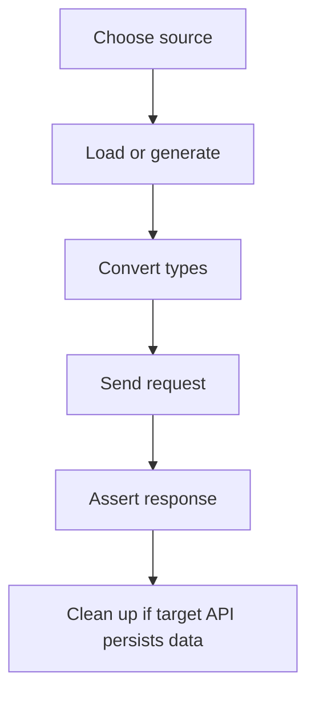

# Test Data Strategy

A framework needs a strategy for choosing data sources. The goal is not to use every data style everywhere. The goal is to choose the smallest data approach that makes the test clear, repeatable, and useful.

## Decision Table

| Situation | Good choice | Reason |
| --- | --- | --- |
| Two or three simple values | Inline parametrize | Keeps the test easy to read |
| API request bodies | JSON file | Matches API payload shape |
| Query combinations | CSV file | Easy table format |
| Names, text, emails, addresses | Seeded Faker | Realistic and reproducible |
| Security or auth credentials | Environment variables or secrets manager | Avoids committing secrets |
| Data that must exist in a backend | Fixture/setup API or database setup | Controls lifecycle |

## Data Lifecycle

JSONPlaceholder does not truly persist created data, so Module 09 does not need cleanup. Real APIs usually do.

## Data Ownership

| Layer | Owns |
| --- | --- |
| [`test-data/`](../../test-data/) | Static examples and reusable payload rows |
| [`src/utils/data_loader.py`](../../src/utils/data_loader.py) | File-loading mechanics |
| test files | Scenario logic, type conversion, API calls, assertions |
| future factories | Generated objects with domain rules |

## Common Mistakes

| Mistake | Better approach |
| --- | --- |
| Putting huge payloads directly in test functions | Move payloads to JSON |
| Reading files with repeated open/read logic in every test | Use `load_json_data()` or `load_csv_data()` |
| Using unseeded randomness in CI | Seed Faker or log generated values clearly |
| Mixing expected results into test code and inputs into files | Keep each case self-contained when practical |
| Treating generated data as coverage by itself | Assert behavior and contracts clearly |

## What Changes In Later Modules

Module 10 will validate response bodies with schemas. Module 11 will discuss richer contract testing and flaky API handling. Module 15 will organize DummyJSON capstone data by domain.

Module 09 is the foundation: load data, generate data, keep it reproducible, and keep tests readable.

## Code References

- [`test-data/module_09/`](../../test-data/module_09/)
- [`src/utils/data_loader.py`](../../src/utils/data_loader.py)
- [`tests/learning/test_09_data_driven/`](../../tests/learning/test_09_data_driven/)

## Key Takeaways

- Data strategy is a framework design decision.
- Choose the simplest data source that fits the test.
- Static and generated data can coexist.
- Reproducibility matters more than novelty.
