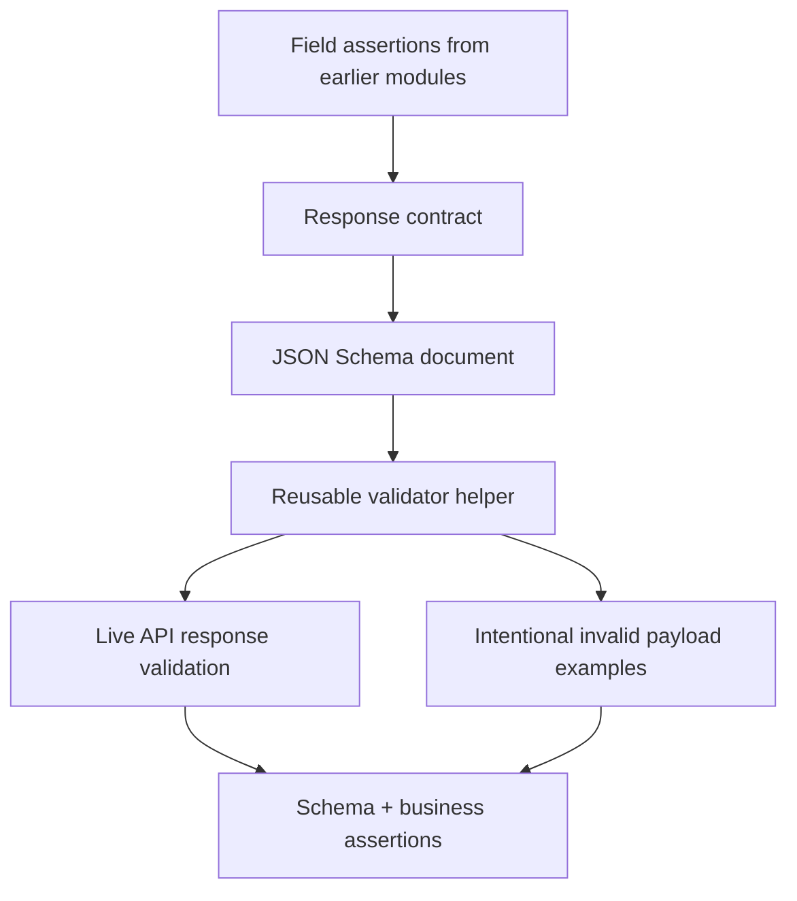

# Module 10: Schema Validation

Module 10 teaches how to validate API response structure with JSON Schema. Earlier modules checked individual fields with direct assertions. Those assertions are still useful, but schema validation gives the framework a reusable way to check response contracts.

## What This Module Builds

| Area | Files | Purpose |
| --- | --- | --- |
| Dependency | [`requirements.txt`](../../requirements.txt) | Activates `jsonschema` |
| Schema helpers | [`src/utils/schema_validator.py`](../../src/utils/schema_validator.py) | Loads schemas, validates JSON, and collects validation errors |
| JSON Schemas | [`schemas/jsonplaceholder/`](../../schemas/jsonplaceholder/) | Defines response contracts for posts, comments, users, and post collections |
| Schema tests | [`tests/learning/test_10_schema/`](../../tests/learning/test_10_schema/) | Validates live JSONPlaceholder responses and intentional failure examples |
| Learning docs | `docs/module-10-schema-validation/` | Explains schema concepts and maps them to project files |

## Learning Flow

## Concepts Covered

| Concept | What you learn | Code reference |
| --- | --- | --- |
| JSON Schema basics | `type`, `required`, `properties`, `additionalProperties` | [`post.schema.json`](../../schemas/jsonplaceholder/post.schema.json) |
| Nested schemas | Object schemas inside object schemas | [`user.schema.json`](../../schemas/jsonplaceholder/user.schema.json) |
| Array schemas | Validate collection shape and item shape together | [`post_collection.schema.json`](../../schemas/jsonplaceholder/post_collection.schema.json) |
| Helper validation | Keep validator setup out of tests | [`src/utils/schema_validator.py`](../../src/utils/schema_validator.py) |
| Format checking | `format` needs framework support to be enforced | [`test_contract_boundaries.py`](../../tests/learning/test_10_schema/test_contract_boundaries.py) |
| Boundaries | Schema checks shape; assertions still check behavior | `test_schema_does_not_replace_business_assertions` |
| Checkpoint review | Schema execution flow, helper boundaries, failure model, and interview review | [`06-checkpoint-deep-dive.md`](06-checkpoint-deep-dive.md) |

## What Is Intentionally Deferred

Module 10 does not build consumer-driven contract testing. That belongs in Module 11's advanced testing discussion.

Module 10 also does not generate schemas automatically from OpenAPI. The learning goal is to understand schema rules manually before relying on generated artifacts.

## Quality Gate

Module 10 is complete when:

- `jsonschema` is active in [`requirements.txt`](../../requirements.txt).
- reusable schema helpers exist in [`src/utils/schema_validator.py`](../../src/utils/schema_validator.py).
- JSONPlaceholder schemas exist under [`schemas/jsonplaceholder/`](../../schemas/jsonplaceholder/).
- tests validate posts, comments, users, and collections.
- tests show missing fields, unexpected fields, format failures, and business assertion boundaries.
- docs link schema concepts to real code and schema files.
- `python -m pytest tests/learning/test_10_schema -v` passes.
- the full suite passes with `python -m pytest tests/ -v`.

## Key Takeaways

- Schema validation checks the shape and contract of JSON responses.
- `required` catches missing fields.
- `additionalProperties: false` catches unexpected fields.
- `format` only works as an assertion when the validator is configured with a format checker.
- Schema validation complements scenario assertions; it does not replace them.
