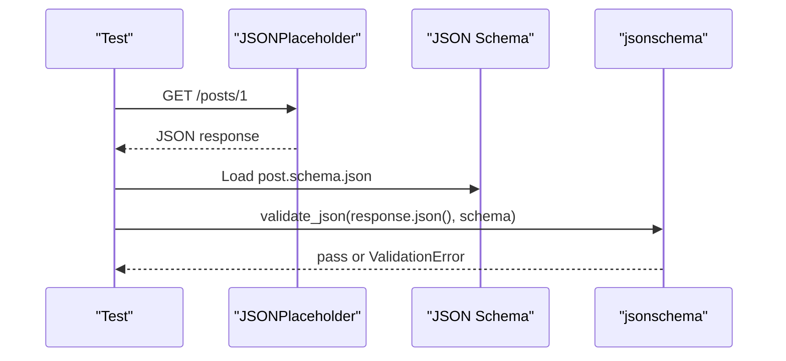

# JSON Schema Basics

JSON Schema is a vocabulary for describing valid JSON. In API testing, it helps answer:

> Does this response have the shape the API contract promises?

## A Small Schema

`schemas/jsonplaceholder/post.schema.json` describes a JSONPlaceholder post:

```json
{
  "type": "object",
  "required": ["userId", "id", "title", "body"],
  "properties": {
    "userId": { "type": "integer", "minimum": 1 },
    "id": { "type": "integer", "minimum": 1 },
    "title": { "type": "string", "minLength": 1 },
    "body": { "type": "string", "minLength": 1 }
  },
  "additionalProperties": false
}
```

## Core Keywords

| Keyword | Meaning | Example |
| --- | --- | --- |
| `type` | Expected JSON type | object, array, string, integer |
| `required` | Fields that must exist | `["id", "title"]` |
| `properties` | Rules for named fields | `"id": {"type": "integer"}` |
| `minimum` | Smallest numeric value | ID must be at least `1` |
| `minLength` | Smallest string length | title cannot be empty |
| `additionalProperties` | Whether unknown fields are allowed | `false` rejects extra keys |

## JSON Types vs Python Types

| JSON Schema type | Python value after `response.json()` |
| --- | --- |
| `object` | `dict` |
| `array` | `list` |
| `string` | `str` |
| `integer` | `int` |
| `number` | `int` or `float` |
| `boolean` | `bool` |
| `null` | `None` |

## Validation Flow



## Code References

- `schemas/jsonplaceholder/post.schema.json`
- `tests/learning/test_10_schema/test_schema_helpers.py`
- `tests/learning/test_10_schema/test_response_schemas.py`

## Key Takeaways

- JSON Schema describes expected JSON structure.
- It is stronger than checking one or two fields manually.
- Strict schemas can catch accidental API contract changes.
- Strictness should be intentional, not automatic.
