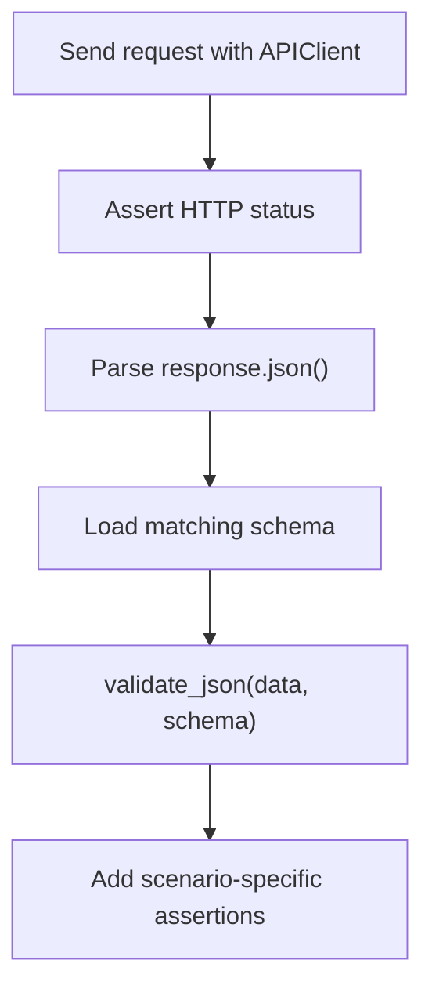

# Validating API Responses

Module 10 validates live JSONPlaceholder responses with schemas.

## Single Object Validation

[`test_response_schemas.py`](../../tests/learning/test_10_schema/test_response_schemas.py) validates a single post:

```python
def test_single_post_matches_schema(api_client, post_schema):
    response = api_client.get("/posts/1")

    assert response.status_code == 200
    validate_json(response.json(), post_schema)
```

This checks the response body has:

- `userId`
- `id`
- `title`
- `body`
- no unexpected fields
- correct field types
- non-empty title and body

## Collection Validation

There are two common collection strategies.

### Validate Each Item

```python
for post in posts:
    validate_json(post, post_schema)
```

This is useful when you already have an item schema and want each item checked.

### Validate The Array

```python
validate_json(response.json(), post_collection_schema)
```

This checks the response is an array and every item matches the item rules.

Module 10 includes both examples so learners can see the difference.

## Nested Object Validation

Users have nested objects:

```text
user
├── address
│   └── geo
└── company
```

[`user.schema.json`](../../schemas/jsonplaceholder/user.schema.json) validates those nested structures with nested `properties`, `required`, and `additionalProperties` rules.

## Response Validation Pipeline



## Code References

- [`test_response_schemas.py`](../../tests/learning/test_10_schema/test_response_schemas.py)
- [`post.schema.json`](../../schemas/jsonplaceholder/post.schema.json)
- [`post_collection.schema.json`](../../schemas/jsonplaceholder/post_collection.schema.json)
- [`comment.schema.json`](../../schemas/jsonplaceholder/comment.schema.json)
- [`user.schema.json`](../../schemas/jsonplaceholder/user.schema.json)

## Key Takeaways

- Validate status code before validating schema.
- Validate collections intentionally: item-by-item or whole-array schema.
- Nested responses need nested schema rules.
- Schema validation belongs beside scenario assertions, not instead of them.
