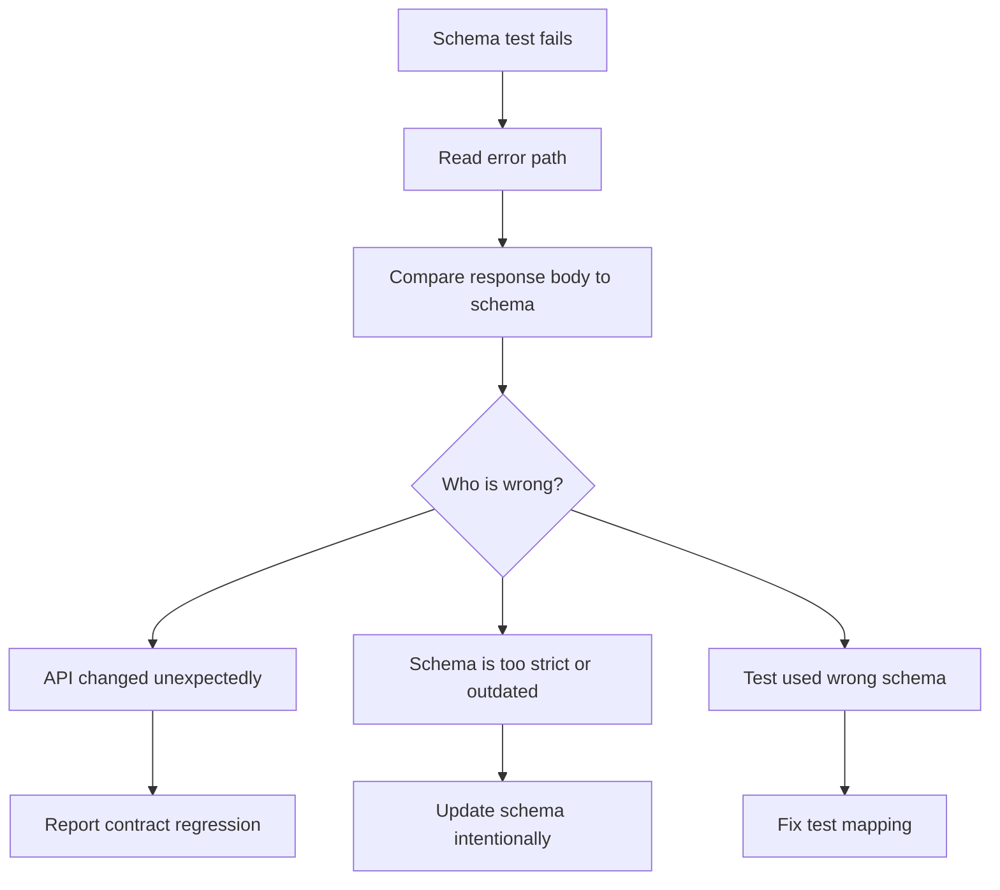

# Schema Failures And Debugging

Schema tests are most useful when failures explain what changed.

## First Error vs All Errors

`validate_json()` raises on the first validation error:

```python
validate_json(data, schema)
```

That is good for concise tests.

`collect_validation_errors()` returns all validation failures:

```python
errors = collect_validation_errors(data, schema)
```

That is useful when teaching or diagnosing a broad contract mismatch.

## Examples In Module 10

| Test | What it proves |
| --- | --- |
| `test_schema_catches_missing_required_fields` | `required` catches missing fields |
| `test_schema_catches_unexpected_fields` | `additionalProperties: false` catches extra fields |
| `test_schema_format_checks_need_framework_support` | `format` rules need validator support |
| `test_collect_validation_errors_returns_all_errors` | Multiple contract failures can be reported together |

## Common Failure Messages

| Message style | Likely cause |
| --- | --- |
| `is a required property` | A required field is missing |
| `is not of type` | The value has the wrong type |
| `should be non-empty` | A string failed `minLength` |
| `Additional properties are not allowed` | The response contains an unexpected field |
| `is not a 'email'` | Format checker rejected an email string |

## Debugging Flow



## Schema Strictness

`additionalProperties: false` is strict. It is useful when the API contract says no extra fields should appear.

Strictness can also create noisy failures when an API is intentionally extensible. In those cases, allow extra fields or validate only the stable part of the response.

Module 10 uses strict schemas because JSONPlaceholder responses are stable and predictable.

## Code References

- `tests/learning/test_10_schema/test_contract_boundaries.py`
- `tests/learning/test_10_schema/test_schema_helpers.py`
- `src/utils/schema_validator.py`

## Key Takeaways

- Schema failures should guide investigation.
- Collecting all errors can make broad contract failures easier to understand.
- Strict schemas are powerful, but strictness must match the API contract.
- A schema failure may mean the API changed, the schema is stale, or the test used the wrong schema.
