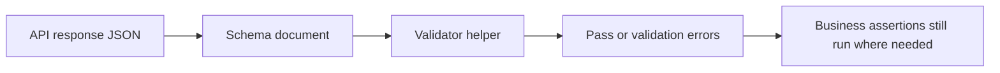

# Module 10 Checkpoint Deep Dive

This checkpoint adds reusable response-contract validation. Earlier modules asserted individual fields directly. Module 10 keeps those assertions, but adds JSON Schema so response shape can be checked consistently across tests.

## Mental Model

Schema validation is a contract gate:

A schema answers "Does this payload have the expected structure and data types?" It does not answer "Is this the correct post for this scenario?" That second question still belongs in test assertions.

## Execution Flow

For a live schema test:

1. A fixture loads a schema with [`load_schema`](../../src/utils/schema_validator.py).
2. A test calls the API through [`APIClient`](../../src/api_client/client.py).
3. The test asserts the status code.
4. The response body is passed to `validate_json`.
5. `Draft202012Validator` validates the body with a `FormatChecker`.
6. The test adds business assertions when scenario-specific behavior matters.

The contract-boundary tests use `collect_validation_errors` so learners can inspect every schema problem instead of stopping at the first one.

## Code Walkthrough

[`src/utils/schema_validator.py`](../../src/utils/schema_validator.py) has three focused jobs: load schema files, raise on invalid data, and collect all validation errors for analysis. It intentionally does not know about JSONPlaceholder endpoints.

[`schemas/jsonplaceholder/post.schema.json`](../../schemas/jsonplaceholder/post.schema.json) is the simplest object contract. It uses `required`, `properties`, `minimum`, `minLength`, and `additionalProperties: false`.

[`schemas/jsonplaceholder/post_collection.schema.json`](../../schemas/jsonplaceholder/post_collection.schema.json) validates an array and the shape of each item. [`schemas/jsonplaceholder/user.schema.json`](../../schemas/jsonplaceholder/user.schema.json) demonstrates nested objects for `address`, `geo`, and `company`.

[`test_response_schemas.py`](../../tests/learning/test_10_schema/test_response_schemas.py) applies schemas to live responses. [`test_contract_boundaries.py`](../../tests/learning/test_10_schema/test_contract_boundaries.py) shows missing fields, unexpected fields, format checks, and why schema does not replace business assertions.

## Python And Framework Syntax To Notice

| Syntax | Why It Matters |
|---|---|
| `Draft202012Validator(...)` | Chooses the JSON Schema draft used by the framework |
| `FormatChecker()` | Enforces supported formats such as `email` |
| `.validate(data)` | Raises on the first validation failure |
| `.iter_errors(data)` | Produces all validation failures for analysis |
| `sorted(..., key=lambda error: list(error.path))` | Makes error ordering stable |
| `with pytest.raises(ValidationError)` | Tests intentional invalid payload behavior |
| module-scoped schema fixtures | Avoid repeated file loading inside one schema test module |

## Responsibility Boundaries

At this checkpoint:

- Schema files define structural contracts.
- Validator helpers load and apply schemas.
- Tests decide which API response should match which schema.
- Tests still assert business facts such as IDs, ownership, counts, and relationships.
- Consumer-driven contracts, OpenAPI-generated schemas, and provider verification are deferred to Module 11 discussion.

Do not put endpoint behavior into a schema when a normal assertion would communicate the scenario better.

## Common Mistakes

- Believing schema validation replaces all assertions.
- Forgetting that `format` is not enforced unless a format checker is configured.
- Setting `additionalProperties: false` before the API contract is stable enough.
- Writing schemas that are so loose they only check "object" or "array".
- Writing schemas that are so strict they fail on harmless optional fields.
- Validating only the first item in a collection when every item matters.

## Debugging And Failure Model

| Failure | Likely Cause |
|---|---|
| Required property missing | API omitted a documented field or schema expects the wrong field |
| Wrong type | API returned a different JSON type than the contract says |
| Additional property error | API added a field or schema is too strict |
| Format error | Value does not satisfy configured format checking |
| Collection schema failure | One array item is invalid or array-level constraints failed |
| Business assertion failure after schema pass | Shape is valid but scenario behavior is wrong |

When schema validation fails, inspect `error.path`, `error.message`, and the response snippet near the failing path.

## Interview Readiness

After this module, you should be able to answer:

- What does JSON Schema validate in an API response?
- What is the purpose of `required`?
- Why use `additionalProperties: false` carefully?
- Why does `format` need validator support?
- How is schema validation different from business validation?
- How would you debug a schema validation failure?

## Revision Checklist

- I can explain the post schema without reading the docs.
- I can trace a live response through [`validate_json`](../../src/utils/schema_validator.py).
- I can explain why collection schemas and item schemas are both useful.
- I can read validation error messages and locate the failing field.
- I can identify which assertions should remain outside the schema.
