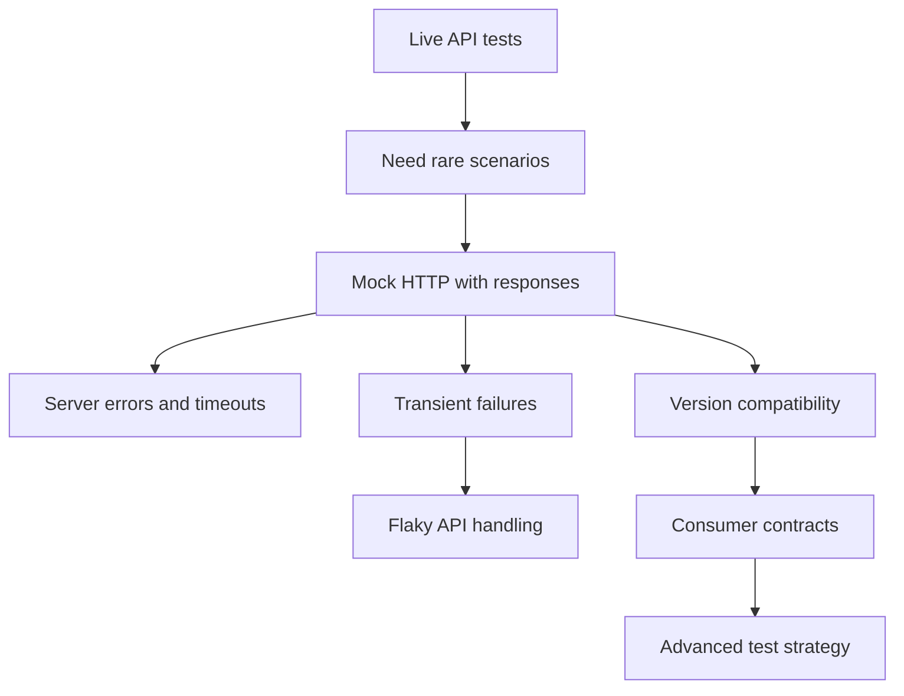

# Module 11: Advanced Testing

Module 11 moves beyond happy-path live API tests. It shows how to test rare errors, timeouts, flaky behavior, API version compatibility, and consumer-focused contracts without waiting for a real service to fail.

The module activates `responses`, a mocking library for `requests`, so the framework can simulate HTTP behavior deterministically.

## What This Module Builds

| Area | Files | Purpose |
| --- | --- | --- |
| Mocking dependency | `requirements.txt` | Activates `responses` |
| Mocked error tests | `tests/learning/test_11_advanced/test_mocked_error_paths.py` | Simulates `500` errors and timeout exceptions |
| Flaky API examples | `tests/learning/test_11_advanced/test_flaky_api_patterns.py` | Reproduces transient failure and recovery deterministically |
| Version compatibility tests | `tests/learning/test_11_advanced/test_version_compatibility.py` | Checks additive vs breaking API changes |
| Contract boundary tests | `tests/learning/test_11_advanced/test_contract_boundaries.py` | Explains consumer contracts vs provider schemas |

## Learning Flow

## Concepts Covered

| Concept | What you learn | Code reference |
| --- | --- | --- |
| Mocked HTTP | Simulate API responses without real network dependency | `test_mocked_error_paths.py` |
| Timeout testing | Exercise exceptions without slowing the suite | `test_timeout_exception_can_be_exercised_without_waiting` |
| Flaky API handling | Reproduce transient failure then recovery | `test_flaky_api_patterns.py` |
| Retryable status thinking | Classify transient statuses before adding retry logic | `is_retryable_status()` |
| API version compatibility | Additive changes should not break stable consumers | `test_version_compatibility.py` |
| Consumer contracts | Validate fields the client depends on | `test_contract_boundaries.py` |

## What Is Intentionally Deferred

Module 11 does not add retry behavior to `APIClient`. Retry logic affects timing, idempotency, observability, and failure semantics. This module teaches how to reproduce transient behavior first.

Module 11 also does not introduce a full contract-testing broker such as Pact. It explains the consumer-contract mindset using local JSON Schema checks. Full consumer-driven contract tooling belongs in a larger service ecosystem.

## Quality Gate

Module 11 is complete when:

- `responses` is active in `requirements.txt`.
- tests simulate structured server errors and timeouts.
- tests reproduce transient failure then recovery.
- tests explain retryable vs non-retryable status codes.
- tests show additive and breaking API version changes.
- tests distinguish consumer contracts from full provider schemas.
- docs link each advanced concept to real test files.
- `python -m pytest tests/learning/test_11_advanced -v` passes.
- the full suite passes with `python -m pytest tests/ -v`.

## Key Takeaways

- Advanced API tests often need controlled simulation.
- Mocking should support learning and determinism, not hide important live behavior.
- Flaky APIs should be reproduced deterministically before adding retry machinery.
- Version compatibility is about preserving fields existing consumers depend on.
- Consumer contracts are narrower than full provider schemas.
