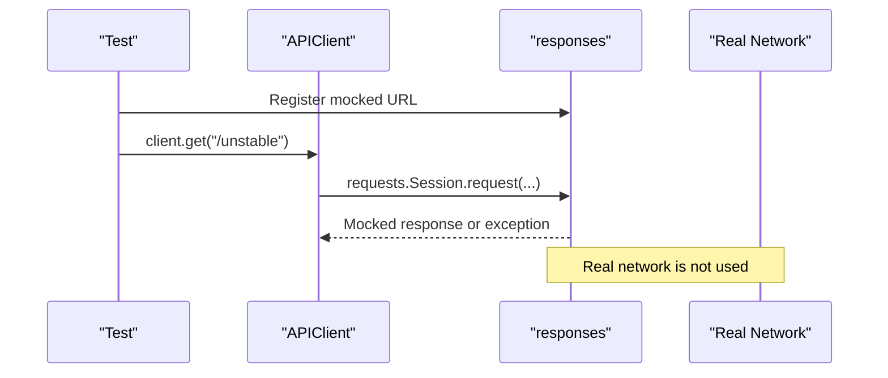

# Mocking HTTP With Responses

Live API tests are valuable, but not every scenario should depend on a live service. Some behaviors are rare, slow, expensive, or destructive.

Module 11 uses `responses` to mock HTTP calls made by `requests`.

## Why Mock API Responses

| Scenario | Why mocking helps |
| --- | --- |
| `500` server error | You should not wait for a real outage |
| timeout | You should not make the suite sleep |
| malformed response | The real API may not expose one on demand |
| transient failure | Reproducing flakiness should be deterministic |
| version compatibility | You can compare controlled v1 and v2 bodies |

## Basic Pattern

```python
@responses.activate
def test_client_can_assert_structured_500_response_without_live_api():
    client = APIClient("https://service.test")
    responses.add(
        responses.GET,
        "https://service.test/unstable",
        json={"error": "temporary outage", "request_id": "req-module-11"},
        status=500,
    )

    response = client.get("/unstable")

    assert response.status_code == 500
```

The test still uses `APIClient`; only the network boundary is replaced.

## Timeout Without Waiting

```python
def raise_timeout(_request):
    raise requests.Timeout("mocked timeout")
```

The timeout test proves the framework can exercise exception behavior immediately. It does not need a real slow endpoint or a long timeout value.

## Mocking Boundary



## What Mocking Does Not Prove

Mocking does not prove the real API is available, deployed, or configured correctly. It proves the test code handles a specific HTTP behavior.

That is why this project keeps both:

- live JSONPlaceholder learning tests
- mocked advanced behavior tests

## Code References

- [`requirements.txt`](../../requirements.txt)
- [`test_mocked_error_paths.py`](../../tests/learning/test_11_advanced/test_mocked_error_paths.py)
- [`src/api_client/client.py`](../../src/api_client/client.py)

## Key Takeaways

- Mocking is useful for rare or hard-to-trigger behavior.
- Keep the framework client in the test path.
- Mock the network boundary, not the assertion logic.
- Do not replace all live tests with mocks.
