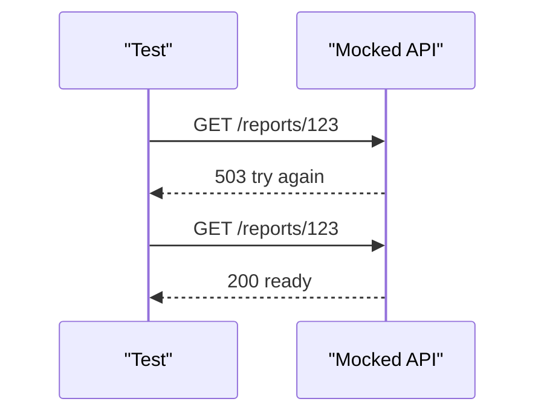

# Flaky API Handling

A flaky API test fails sometimes without a clear product change. The root cause might be the API, network, rate limiting, timing, shared data, or the test itself.

Module 11 does not add retry logic to `APIClient`. It first teaches how to reproduce transient behavior deterministically.

## Common Flaky API Causes

| Cause | Example |
| --- | --- |
| transient server issue | `503 Service Unavailable` |
| rate limit | `429 Too Many Requests` |
| timeout | request exceeds allowed time |
| eventual consistency | data is not visible immediately |
| shared test data | another test changes state |
| external dependency | upstream service is slow or down |

## Retryable Status Codes

[`test_flaky_api_patterns.py`](../../tests/learning/test_11_advanced/test_flaky_api_patterns.py) includes a small classifier:

```python
def is_retryable_status(status_code: int) -> bool:
    return status_code in {408, 429, 500, 502, 503, 504}
```

This is not a full retry policy. It is a teaching step: before retrying, define what is retryable.

## Sequenced Mocking

```python
responses.add(responses.GET, url, json={"error": "try again"}, status=503)
responses.add(responses.GET, url, json={"id": 123, "status": "ready"}, status=200)
```

The first call fails with `503`. The second call succeeds with `200`.

That makes a flaky pattern reproducible:



## Why Not Add Retries Yet

Retries sound simple, but they raise design questions:

- Which methods are safe to retry?
- How many attempts are allowed?
- Should retries use backoff?
- How are retries logged?
- How do reports show first failure vs final success?
- What happens when the request is not idempotent?

Those concerns belong in framework policy. Module 11 stays focused on deterministic reproduction and reasoning.

## Code References

- [`test_flaky_api_patterns.py`](../../tests/learning/test_11_advanced/test_flaky_api_patterns.py)

## Key Takeaways

- Do not dismiss every intermittent failure as random.
- Reproduce transient behavior deterministically before adding retry logic.
- Define retryable statuses explicitly.
- Retry policy is framework behavior, not an assertion trick.
