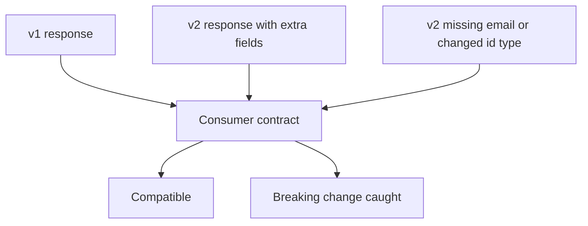

# API Version Compatibility

APIs evolve. A new version should avoid breaking existing consumers unless a breaking change is intentional, communicated, and managed.

Module 11 models version compatibility with mocked v1 and v2 user responses.

## Additive vs Breaking Changes

| Change | Compatibility impact |
| --- | --- |
| Add optional field | usually compatible |
| Add nested metadata | usually compatible |
| Remove required field | breaking |
| Rename required field | breaking |
| Change field type | breaking |
| Change meaning of a field | often breaking |

## Compatible Consumer Schema

[`test_version_compatibility.py`](../../tests/learning/test_11_advanced/test_version_compatibility.py) defines the fields this consumer needs:

```python
USER_SUMMARY_COMPATIBLE_SCHEMA = {
    "required": ["id", "name", "email"],
    "properties": {
        "id": {"type": "integer", "minimum": 1},
        "name": {"type": "string", "minLength": 1},
        "email": {"type": "string", "format": "email"},
    },
    "additionalProperties": True,
}
```

Notice `additionalProperties: True`. This is intentional: a consumer contract can allow provider fields it does not use.

## Compatibility Flow



## Mocking Multiple Versions

The module mocks:

```text
GET /v1/users/1
GET /v2/users/1
```

Both responses must satisfy the same consumer contract. That proves the v2 response stayed compatible for this client.

## Code References

- [`test_version_compatibility.py`](../../tests/learning/test_11_advanced/test_version_compatibility.py)
- [`src/utils/schema_validator.py`](../../src/utils/schema_validator.py)

## Key Takeaways

- Version compatibility is about protecting consumers.
- Additive fields are usually safe when consumers allow unknown fields.
- Removing required fields or changing types is breaking.
- A compatibility schema can be intentionally looser than a full provider schema.
