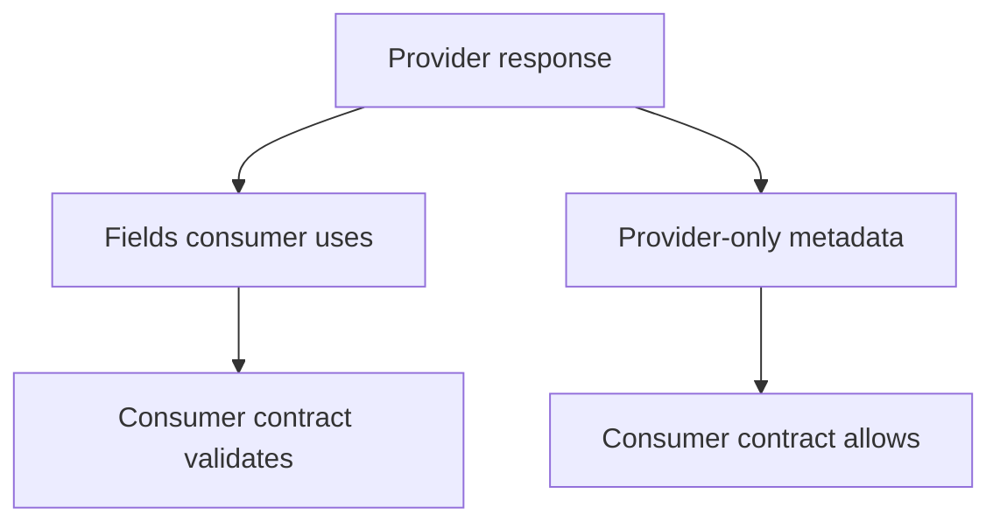

# Consumer Contract Boundaries

Module 10 introduced strict schemas. Module 11 adds nuance: not every contract test needs to validate the entire provider response.

Consumer contracts focus on what this client depends on.

## Provider Schema vs Consumer Contract

| Type | Purpose | Strictness |
| --- | --- | --- |
| Provider schema | Defines the full response the API promises | often strict |
| Consumer contract | Defines the fields this consumer needs | intentionally focused |

## Error Response Example

`test_contract_boundaries.py` defines:

```python
ERROR_CONTRACT_SCHEMA = {
    "required": ["error", "request_id"],
    "properties": {
        "error": {"type": "string", "minLength": 1},
        "request_id": {"type": "string", "minLength": 1},
    },
    "additionalProperties": True,
}
```

The client depends on:

- `error`
- `request_id`

The provider may also return:

- `support_url`
- `debug_code`
- other metadata

Those extra fields should not break this consumer contract.

## Contract Boundary Diagram



## What The Tests Prove

| Test | Lesson |
| --- | --- |
| `test_consumer_contract_checks_fields_the_client_depends_on` | Validate dependency fields on mocked API response |
| `test_contract_test_should_ignore_provider_details_not_used_by_consumer` | Extra provider details should not break the consumer |
| `test_consumer_contract_catches_missing_dependency_field` | Missing dependency fields are real contract failures |

## Important Boundary

Consumer contracts do not replace provider tests. Provider tests should still validate the full API contract. Consumer contracts protect a specific client from changes that would break it.

## Code References

- `tests/learning/test_11_advanced/test_contract_boundaries.py`
- `tests/learning/test_10_schema/test_response_schemas.py`

## Key Takeaways

- Consumer contracts are intentionally focused.
- Extra provider fields can be safe if the consumer does not rely on them.
- Missing consumer dependency fields are breaking.
- Contract testing is a collaboration pattern, not just a schema file.
