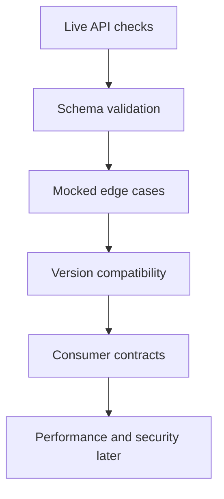

# Advanced Test Strategy

Advanced API testing is not about adding complexity everywhere. It is about choosing the right level of control for the risk being tested.

## Test Type Selection

| Risk | Useful test style |
| --- | --- |
| endpoint health | live smoke test |
| response shape | schema validation |
| rare server error | mocked response |
| timeout behavior | mocked exception |
| transient failure | sequenced mock |
| backward compatibility | consumer contract |
| full provider contract | provider schema or contract suite |
| performance risk | Module 12 performance checks |

## Layered Strategy

## When To Mock

Mock when the behavior is:

- rare
- slow
- hard to create safely
- external to the test goal
- needed for deterministic failure analysis

Avoid mocking when the goal is to prove:

- the deployed service works
- real authentication works
- real integration wiring works
- real data exists

## What Module 11 Adds To The Framework

Module 11 does not add many production abstractions. That is intentional.

It adds:

- `responses` as an active dependency
- examples for deterministic HTTP mocking
- compatibility thinking
- contract-boundary thinking
- flaky API reproduction patterns

The learner now has patterns for tests that should not depend on live API behavior.

## Code References

- [`tests/learning/test_11_advanced/`](../../tests/learning/test_11_advanced/)
- [`requirements.txt`](../../requirements.txt)

## Key Takeaways

- Use live tests and mocked tests for different purposes.
- Advanced tests should reduce uncertainty, not create cleverness.
- Deterministic reproduction is the first step toward handling flaky behavior.
- Compatibility and contract tests should reflect real consumer risk.
