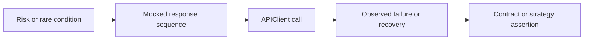

# Module 11 Checkpoint Deep Dive

This checkpoint teaches controlled simulation for cases that are hard, slow, or unreliable to trigger against a live service. The module does not add retry behavior to the client. It teaches how to reproduce failure modes first.

## Mental Model

Advanced tests make rare behavior deterministic:

Mocking is useful when the target condition matters but the real service should not be forced to fail during the test run.

## Execution Flow

For a mocked error-path test:

1. `@responses.activate` intercepts Requests traffic inside the test.
2. The test registers a method, URL, body, and status with `responses.add`.
3. [`APIClient`](../../src/api_client/client.py) sends what looks like a normal request.
4. `responses` returns the registered fake response or raises a configured exception.
5. The test asserts error body, status, timeout exception, call count, or contract behavior.

This gives deterministic feedback without depending on real outages, real timeouts, or production instability.

## Code Walkthrough

[`test_mocked_error_paths.py`](../../tests/learning/test_11_advanced/test_mocked_error_paths.py) covers a structured `500` response and a timeout exception. The timeout uses `responses.add_callback` to raise `requests.Timeout` immediately, so the suite does not sleep.

[`test_flaky_api_patterns.py`](../../tests/learning/test_11_advanced/test_flaky_api_patterns.py) defines `is_retryable_status` and uses sequenced mocked responses to reproduce "503 then 200" behavior. This explains retry thinking before retry mechanics exist in the client.

[`test_version_compatibility.py`](../../tests/learning/test_11_advanced/test_version_compatibility.py) models additive versus breaking API changes with a consumer-friendly schema that allows extra fields but requires stable fields.

[`test_contract_boundaries.py`](../../tests/learning/test_11_advanced/test_contract_boundaries.py) shows that consumer contracts are narrower than full provider schemas. They should protect fields the client actually depends on.

## Python And Framework Syntax To Notice

| Syntax | Why It Matters |
|---|---|
| `@responses.activate` | Enables Requests interception for one test |
| `responses.add(...)` | Registers a mocked response |
| `responses.add_callback(...)` | Simulates dynamic behavior or exceptions |
| `responses.calls` | Lets a test assert how many HTTP calls occurred |
| `with pytest.raises(requests.Timeout)` | Verifies exception behavior without waiting |
| `additionalProperties: True` | Allows additive provider fields in consumer contracts |
| sequenced `responses.add` calls | Reproduces transient failure followed by recovery |

## Responsibility Boundaries

At this checkpoint:

- Mock tests may simulate server errors, timeouts, transient responses, and alternate versions.
- Consumer contracts may define the fields this client needs.
- Version tests may distinguish additive and breaking changes.
- The client still should not retry automatically.
- Pact-style broker workflows and provider verification are out of scope.
- Mocking should not replace the live smoke and contract checks from earlier modules.

## Common Mistakes

- Mocking the happy path so thoroughly that the suite no longer proves real integration.
- Adding retries before defining which failures are retryable and safe to retry.
- Retrying non-idempotent operations without thinking about duplicate side effects.
- Treating provider schemas and consumer contracts as the same thing.
- Making compatibility schemas too strict and rejecting harmless additive fields.
- Making mocks unrealistic compared with the real API's error format.

## Debugging And Failure Model

| Failure | Likely Cause |
|---|---|
| Mock not matched | URL, method, or query string differs from registered mock |
| Unexpected real network call | `responses` was not active or URL was not registered |
| Timeout test waits too long | Real timeout was used instead of mocked exception |
| Retryable classifier wrong | Status-code policy is incomplete or overbroad |
| Compatibility test fails on extra field | Schema is too strict for additive changes |
| Consumer contract misses breakage | Contract does not require a field the client uses |

When a mock test fails, inspect the exact URL built by `APIClient` and compare it with the mocked URL.

## Interview Readiness

After this module, you should be able to answer:

- When should you mock API behavior?
- How would you test a timeout without waiting for a real timeout?
- What makes a status code retryable?
- Why is retrying `POST` riskier than retrying `GET`?
- What is an additive API change?
- How does a consumer contract differ from a full provider schema?

## Revision Checklist

- I can trace a mocked response from `responses.add` to `client.get`.
- I can explain why retry behavior is intentionally deferred.
- I can identify a compatibility-breaking response.
- I can write a consumer contract for only the fields a client needs.
- I can explain which advanced tests should still remain live integration tests.
