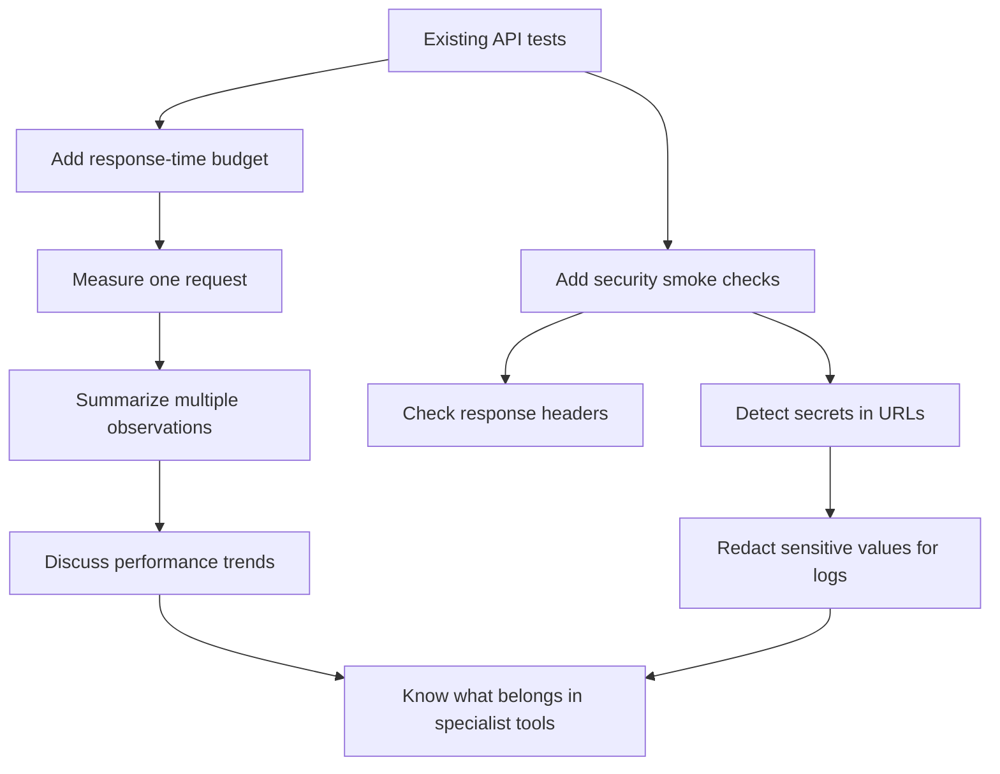
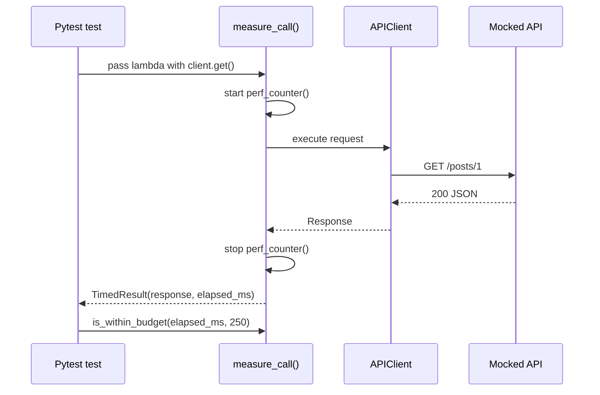
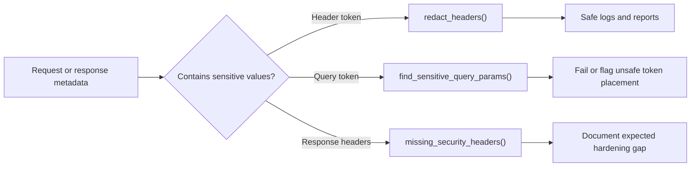

# Module 12: Performance And Security

Module 12 adds learning-level performance and security checks to the API test framework. The goal is not to replace load testing or penetration testing. The goal is to teach how an API automation suite can catch obvious response-time regressions, unsafe token exposure, and missing security signals early.

This module uses deterministic helper functions and mocked HTTP examples where timing stability matters.

## What This Module Builds

| Area | Files | Purpose |
| --- | --- | --- |
| Performance helpers | [`src/utils/performance.py`](../../src/utils/performance.py) | Measure one operation, check response-time budgets, and summarize timing samples |
| Security helpers | [`src/utils/security.py`](../../src/utils/security.py) | Redact sensitive headers, detect sensitive query parameters, and check required headers |
| Response-time tests | [`test_response_time_budgets.py`](../../tests/learning/test_12_performance_security/test_response_time_budgets.py) | Shows single-call budget assertions without relying on live API latency |
| Timing summary tests | [`test_timing_summaries.py`](../../tests/learning/test_12_performance_security/test_timing_summaries.py) | Shows min, average, p95, and max thinking |
| Security header tests | [`test_security_headers.py`](../../tests/learning/test_12_performance_security/test_security_headers.py) | Shows case-insensitive header checks and missing-header reporting |
| Secret handling tests | [`test_secret_handling.py`](../../tests/learning/test_12_performance_security/test_secret_handling.py) | Shows redaction and detection of secrets in URLs |

## Learning Flow

## Concepts Covered

| Concept | What you learn | Code reference |
| --- | --- | --- |
| Response-time budget | A threshold used to flag obviously slow API behavior | `is_within_budget()` in [`src/utils/performance.py`](../../src/utils/performance.py) |
| Measuring operations | Capturing elapsed time around one callable | `measure_call()` in [`src/utils/performance.py`](../../src/utils/performance.py) |
| Timing summary | Reading min, average, p95, and max together | `summarize_timings()` in [`src/utils/performance.py`](../../src/utils/performance.py) |
| Percentiles | Why p95 shows tail latency better than average alone | `percentile()` in [`src/utils/performance.py`](../../src/utils/performance.py) |
| Security headers | Checking for expected response hardening headers | `missing_security_headers()` in [`src/utils/security.py`](../../src/utils/security.py) |
| Secret redaction | Keeping tokens out of logs and reports | `redact_headers()` in [`src/utils/security.py`](../../src/utils/security.py) |
| URL secret detection | Finding risky query parameters such as `access_token` | `find_sensitive_query_params()` in [`src/utils/security.py`](../../src/utils/security.py) |
| Checkpoint review | Helper flow, responsibility boundaries, failure model, and interview review | [`06-checkpoint-deep-dive.md`](06-checkpoint-deep-dive.md) |

## Module Boundary

Module 12 stays inside the API automation suite. It does not introduce load-test tools, vulnerability scanners, dependency scanners, OWASP ZAP, or infrastructure security checks.

Those tools are valuable, but they answer different questions. Module 12 answers:

- Did this endpoint become unexpectedly slow?
- Are our tests teaching safe handling of credentials?
- Can we spot missing or changed security headers?
- Can our logs and reports avoid leaking tokens?

## Performance Check Shape

## Security Check Shape

## What Is Intentionally Deferred

- Load generation with realistic concurrency.
- Stress, soak, spike, and endurance testing.
- Server-side performance profiling.
- Authentication attack testing.
- Penetration testing and vulnerability scanning.
- Browser security behavior validation.
- CI performance trend storage.

Module 13 will discuss CI placement. Module 14 will connect logs and reporting to failure analysis.

## Quality Gate

Module 12 is complete when:

- [`src/utils/performance.py`](../../src/utils/performance.py) contains small, tested timing helpers.
- [`src/utils/security.py`](../../src/utils/security.py) contains small, tested security smoke-check helpers.
- tests use `@pytest.mark.performance` and `@pytest.mark.security` where appropriate.
- timing tests avoid flaky live-network thresholds.
- security tests explain header checks, secret redaction, and URL token risk.
- docs link every concept to the real implementation files.
- `python -m pytest tests/learning/test_12_performance_security -v` passes.
- the full suite passes with `python -m pytest tests/ -v`.

## Key Takeaways

- API automation can include fast performance smoke checks, but it is not a load-test platform.
- A single response-time assertion is useful only when the threshold is stable and meaningful.
- Averages hide slow tail behavior, so p95 and max help explain user-facing risk.
- Tokens should be sent in headers, not query strings.
- Logs and reports should redact secrets before they become artifacts.
