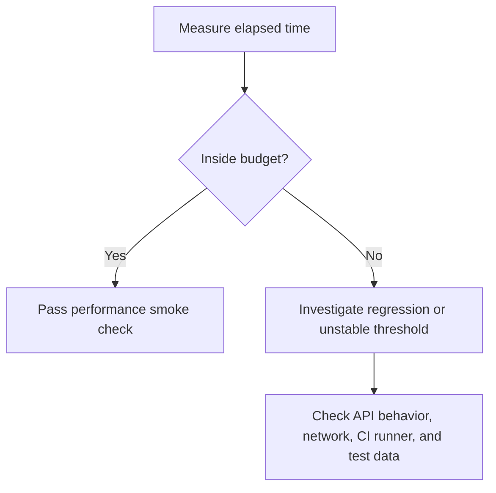
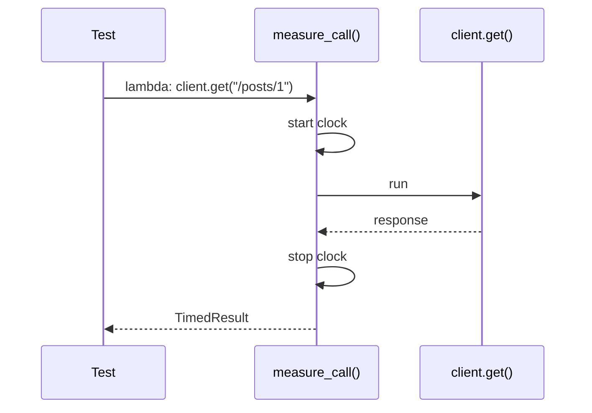

# Response-Time Budgets

A response-time budget is the maximum acceptable elapsed time for a request or operation. In API tests, budgets should be used carefully because network timing can vary across laptops, CI runners, and public APIs.

Module 12 teaches the budget concept with deterministic tests first.

## Budget Thinking



## Code Walkthrough

The budget helper lives in `src/utils/performance.py`:

```python
def is_within_budget(elapsed_ms: float, budget_ms: float) -> bool:
    if budget_ms < 0:
        raise ValueError("budget_ms must be zero or greater")
    return elapsed_ms <= budget_ms
```

The learning test is in `tests/learning/test_12_performance_security/test_response_time_budgets.py`:

```python
assert is_within_budget(elapsed_ms=120, budget_ms=250) is True
assert is_within_budget(elapsed_ms=900, budget_ms=250) is False
```

This teaches the assertion pattern without pretending that a public API will always respond inside the same exact threshold.

## Measuring A Request

`measure_call()` accepts a callable and returns both:

- the operation return value
- elapsed milliseconds



The mocked request test uses `responses` so the example is about framework behavior, not internet speed:

```python
timed_response = measure_call(lambda: client.get("/posts/1"))

assert timed_response.value.status_code == 200
assert is_within_budget(timed_response.elapsed_ms, budget_ms=250)
```

## Good API Test Budgets

Good budget assertions are:

- stable across environments
- generous enough to avoid random failures
- strict enough to catch clear regressions
- scoped to one endpoint or operation
- supported by historical data when used in CI

## Weak API Test Budgets

Weak budget assertions are:

- copied from someone else's machine
- too tight for public API calls
- mixed with unrelated business assertions
- used as a substitute for load testing
- applied to every endpoint without understanding usage

## What This Module Does Not Do

Module 12 does not add automatic failure thresholds to all live JSONPlaceholder tests. That would make the learning suite fragile. Instead, it introduces helpers and examples that can later be applied selectively where the environment is controlled.

## Key Takeaways

- A response-time budget is a testable expectation, not a guess.
- Timing tests need more tolerance than pure functional tests.
- Mocked timing examples teach the pattern without creating flaky public-API checks.
