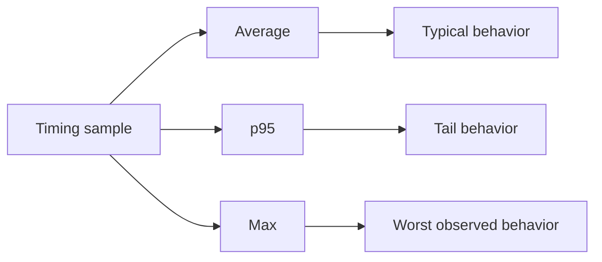
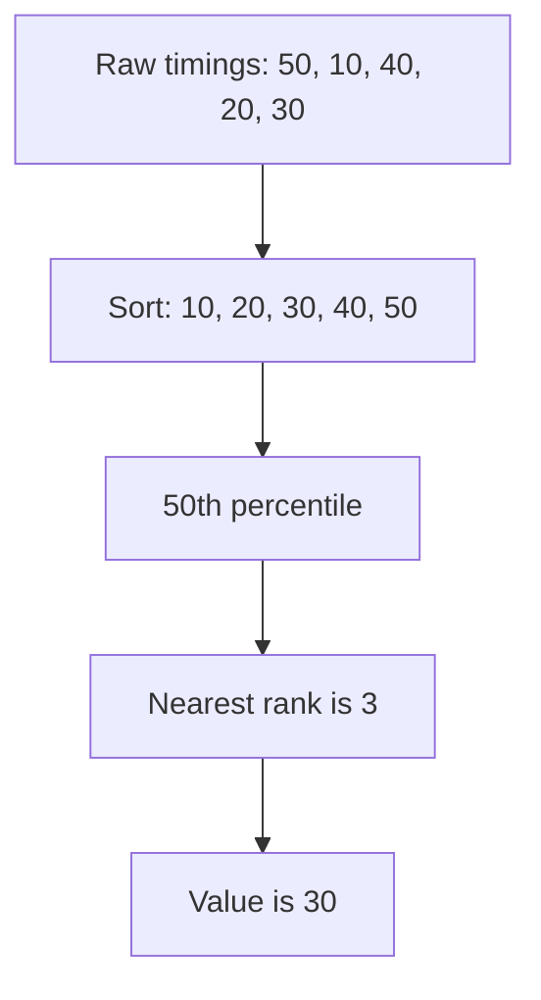
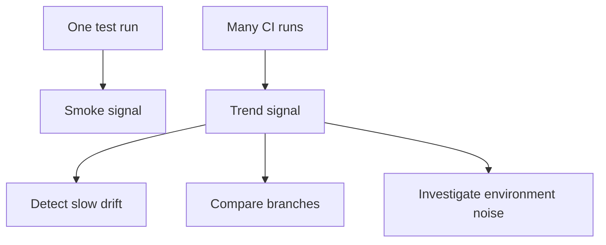

# Timing Summaries And Trends

One response time can tell you whether one request was slow. A group of response times can tell you how the endpoint behaves across repeated observations.

Module 12 introduces a small summary helper for learning min, average, p95, and max.

## Why Average Is Not Enough



If most calls are fast but one call is very slow, the average can hide that pain. Tail metrics such as p95 make slow outliers more visible.

## Code Walkthrough

The helper in `src/utils/performance.py` summarizes a list of elapsed milliseconds:

```python
summary = summarize_timings([120, 180, 200, 300, 500])
```

Expected result from `tests/learning/test_12_performance_security/test_timing_summaries.py`:

```python
{
    "count": 5,
    "min_ms": 120,
    "average_ms": 260,
    "p95_ms": 500,
    "max_ms": 500,
}
```

## Nearest-Rank Percentile

This module uses a nearest-rank percentile because it is easy to explain:

1. Sort the timing sample.
2. Choose the rank for the requested percentile.
3. Return the value at that rank.



For very small samples, p95 can equal the maximum. That is expected. In real performance analysis, larger samples and trend history are more useful.

## How To Interpret Metrics

| Metric | Meaning | Risk if ignored |
| --- | --- | --- |
| `min_ms` | Fastest observed call | Usually less important by itself |
| `average_ms` | Typical central behavior | Can hide slow tail calls |
| `p95_ms` | Most calls are at or below this value | Useful for user-facing latency risk |
| `max_ms` | Slowest observed call | Helps spot outliers |

## Trend Thinking



Module 12 only creates the local summary helper. Module 13 can decide how CI should run these tests, and Module 14 can decide how reports should expose timing information.

## Key Takeaways

- Averages are useful but incomplete.
- p95 helps explain tail latency.
- Small samples teach the concept, but production performance decisions need richer data.
