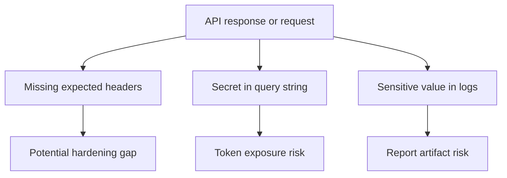

# Security Smoke Checks

Security smoke checks are lightweight assertions that catch obvious issues in an API test suite. They are not a replacement for security testing specialists, threat modeling, penetration testing, or scanner-based workflows.

Module 12 focuses on checks that API testers can understand and maintain.

## What Security Smoke Checks Can Catch



## Security Header Checks

The helper in `src/utils/security.py` checks headers case-insensitively:

```python
has_header(headers, "Content-Security-Policy")
```

The learning tests in `tests/learning/test_12_performance_security/test_security_headers.py` use this required-header list:

```python
REQUIRED_BROWSER_SECURITY_HEADERS = [
    "Content-Security-Policy",
    "Strict-Transport-Security",
    "X-Content-Type-Options",
]
```

Then `missing_security_headers()` reports the missing names:

```python
missing = missing_security_headers(headers, REQUIRED_BROWSER_SECURITY_HEADERS)
```

## Important Nuance

Not every API response needs every browser security header.

For example, browser-facing HTML routes and API JSON routes do not always have the same header requirements. A JSON API may still need transport security, token handling, and cache-control checks, while a browser app also needs stronger content execution controls.

The test `test_api_json_response_may_not_need_every_browser_header` exists to teach this nuance. A missing browser header is a signal to investigate, not always proof of a vulnerability.

## Good Security Smoke Checks

Good checks are:

- explicit about the expected policy
- stable across environments
- focused on observable request or response metadata
- easy to explain when they fail
- linked to product security requirements

## Weak Security Smoke Checks

Weak checks are:

- copied from generic checklists without context
- applied equally to all endpoints
- treated as complete security coverage
- allowed to leak secrets in assertion messages or reports

## Key Takeaways

- Security smoke checks are early warnings.
- Header names are case-insensitive.
- Missing security headers need context.
- API tests should not claim to replace security assessment work.
