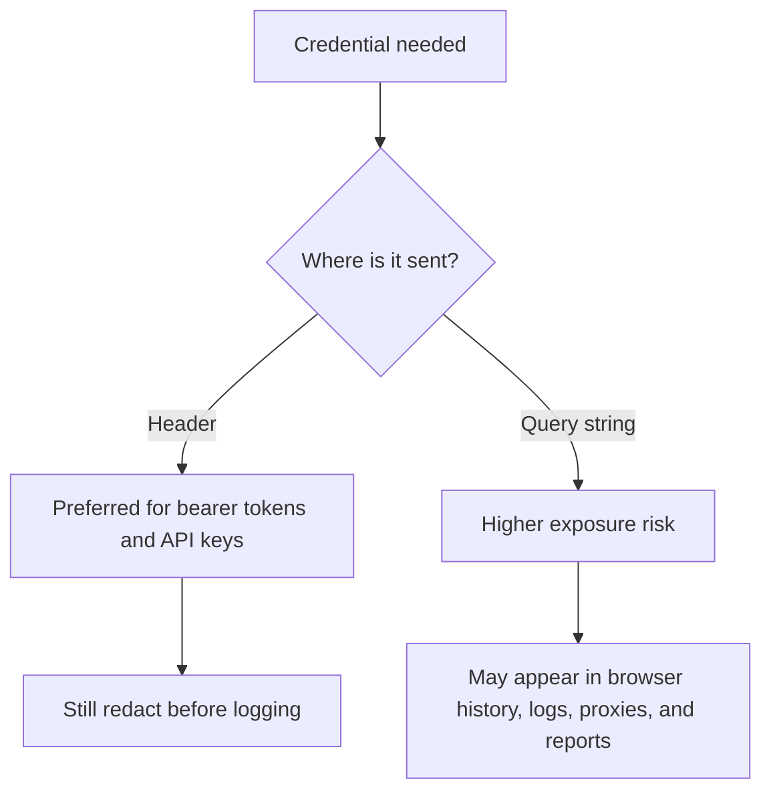
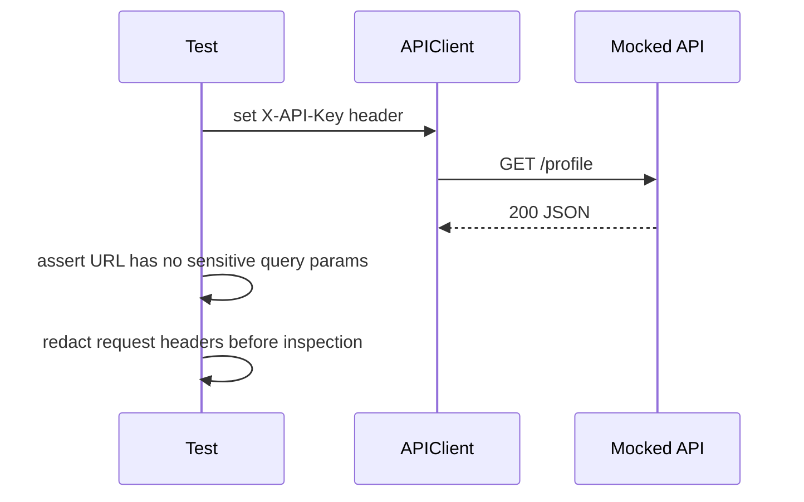

# Secret Handling And Redaction

API tests often touch credentials: bearer tokens, API keys, session cookies, and refresh tokens. A framework should help keep those values out of URLs, logs, and reports.

Module 12 introduces two helper ideas:

- detect sensitive query parameters
- redact sensitive headers before logging or reporting

## Token Placement



## Detecting Secrets In URLs

`find_sensitive_query_params()` lives in `src/utils/security.py`.

It detects query parameter names such as:

- `access_token`
- `api_key`
- `refresh_token`
- `password`
- `secret`
- `token`

The test in `tests/learning/test_12_performance_security/test_secret_handling.py` shows the pattern:

```python
url = "https://service.test/search?query=python&access_token=secret&user=42"

assert find_sensitive_query_params(url) == ["access_token"]
```

This does not validate whether the token is real. It checks whether a dangerous parameter name is present in a URL.

## Redacting Headers

`redact_headers()` returns a copy of the input headers:

```python
redacted = redact_headers(headers)
```

Sensitive headers are replaced with `[REDACTED]`:

```python
{
    "Accept": "application/json",
    "Authorization": "[REDACTED]",
    "X-API-Key": "[REDACTED]",
}
```

The original dictionary is not mutated. That matters because tests may still need the original request object for real assertions.

## Header API Key Example

The mocked test `test_header_api_key_keeps_secret_out_of_url` shows the preferred shape:



The important lesson is not that headers are magic. The lesson is that secrets in headers can be centrally redacted, while secrets in URLs leak into many systems before your test code sees them.

## Key Takeaways

- Avoid putting tokens in query strings.
- Redact secrets before they enter logs and reports.
- Redaction helpers should not mutate the original request data.
- A learning framework should teach safe credential habits before the capstone introduces real login flows.
