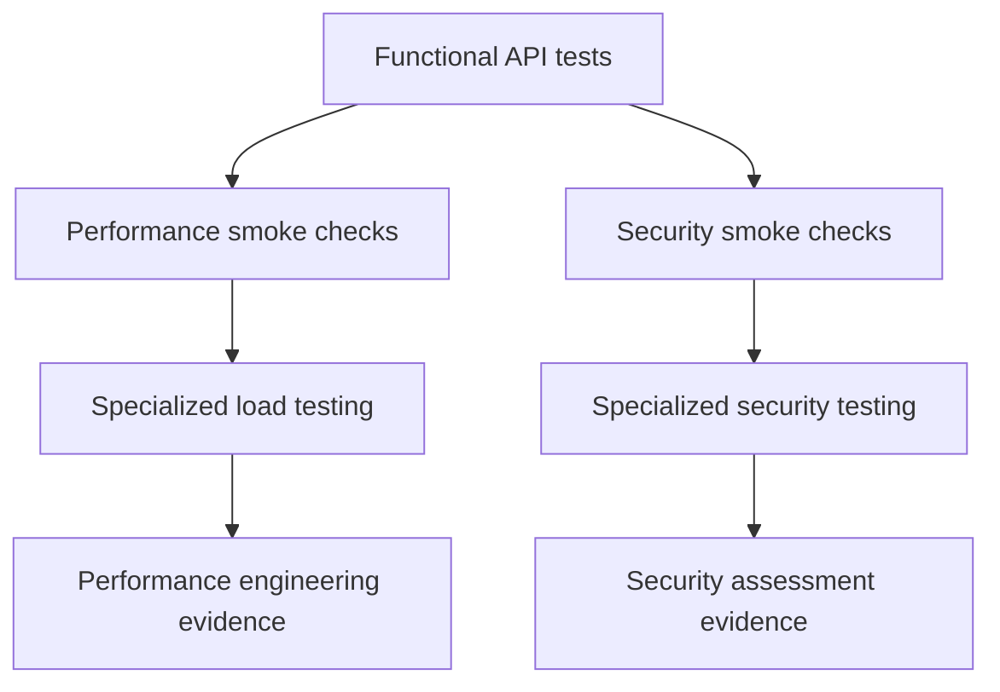
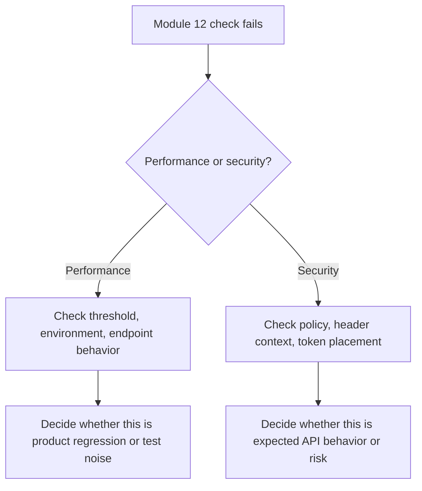

# Performance And Security Strategy

Performance and security checks belong in an API framework, but they need clear scope. If every functional test becomes a timing test and every header check claims to be a vulnerability scan, the suite becomes noisy and misleading.

Module 12 creates a small strategy for what the framework can responsibly test.

## Layered Strategy



## What Belongs In This Pytest Suite

| Check type | Belongs here? | Reason |
| --- | --- | --- |
| Simple response-time budget | Yes, selectively | Catches obvious regressions |
| Timing summary helper | Yes | Teaches how to read latency samples |
| Load generation | No | Needs a dedicated tool and environment |
| Secret redaction | Yes | Protects logs and reports |
| Sensitive query parameter detection | Yes | Easy to check and high-value |
| Full vulnerability scanning | No | Requires specialist tooling and policy |
| Security header smoke checks | Yes, with context | Useful policy signals |

## Test Selection

Module 12 uses existing markers from `pyproject.toml`:

```text
performance: response-time checks
security: introductory security checks
```

Run only performance examples:

```bash
python -m pytest -m performance -v
```

Run only security examples:

```bash
python -m pytest -m security -v
```

Run the whole module:

```bash
python -m pytest tests/learning/test_12_performance_security -v
```

## Failure Interpretation



## What To Avoid

- Do not use tight public API timing thresholds as merge blockers.
- Do not log raw `Authorization`, `Cookie`, or `X-API-Key` values.
- Do not treat missing browser headers on every JSON API response as equal severity.
- Do not call a smoke check a security audit.
- Do not add load testing to this module.

## How This Prepares Later Modules

Module 13 can decide how markers run in CI.

Module 14 can use redaction and logs when building report-based failure analysis.

Module 15 can apply these habits to the DummyJSON capstone, especially around token handling and domain-level API flows.

## Key Takeaways

- Keep performance checks selective and explainable.
- Keep security checks policy-driven and context-aware.
- Treat this module as early warning coverage, not specialist replacement coverage.
