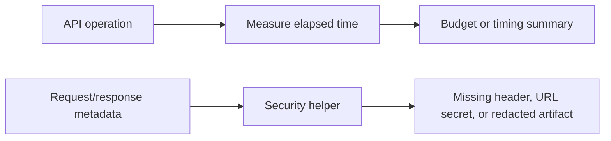

# Module 12 Checkpoint Deep Dive

This checkpoint adds learning-level performance and security checks. These are guardrails inside an API automation suite, not replacements for load testing, penetration testing, or specialist security scanning.

## Mental Model

Module 12 has two lightweight feedback loops:

The helpers are intentionally deterministic. Where timing could be unstable, tests mock the API response and test the framework behavior rather than public network latency.

## Execution Flow

For a response-time budget test:

1. The test registers a mocked response with `responses`.
2. [`measure_call`](../../src/utils/performance.py) records `perf_counter()` before and after the operation.
3. The operation returns an API response.
4. `measure_call` returns a `TimedResult` containing the response and elapsed milliseconds.
5. The test asserts response behavior and checks the elapsed value with `is_within_budget`.

For a secret-handling test:

1. The request or response metadata is represented as headers or a URL.
2. [`redact_headers`](../../src/utils/security.py) returns a safe copy for logs and reports.
3. [`find_sensitive_query_params`](../../src/utils/security.py) flags risky query-string secrets.
4. Assertions verify that sensitive values are not exposed in artifacts.

## Code Walkthrough

[`src/utils/performance.py`](../../src/utils/performance.py) contains small helpers only. `TimedResult` keeps the operation result and timing together. `percentile` uses nearest-rank logic for easy learning examples. `summarize_timings` returns count, min, average, p95, and max.

[`src/utils/security.py`](../../src/utils/security.py) handles security smoke-check utilities: case-insensitive header lookup, required-header gap reporting, sensitive query detection, and header redaction.

[`test_response_time_budgets.py`](../../tests/learning/test_12_performance_security/test_response_time_budgets.py) avoids live latency flakiness by using mocked responses. [`test_timing_summaries.py`](../../tests/learning/test_12_performance_security/test_timing_summaries.py) teaches how averages and tail latency differ.

[`test_secret_handling.py`](../../tests/learning/test_12_performance_security/test_secret_handling.py) focuses on artifact safety. [`test_security_headers.py`](../../tests/learning/test_12_performance_security/test_security_headers.py) teaches header checks without pretending every JSON API response needs every browser hardening header.

## Python And Framework Syntax To Notice

| Syntax | Why It Matters |
|---|---|
| `@dataclass(frozen=True)` | Keeps timed result data simple and immutable |
| `Callable[[], T]` | Lets `measure_call` measure any zero-argument operation |
| `Generic[T]` | Preserves the type of the measured return value |
| `perf_counter()` | Uses a monotonic timer suited for elapsed measurements |
| `ceil(...)` | Implements nearest-rank percentile selection |
| `Mapping[str, str]` | Accepts header-like objects without requiring a plain dict |
| `urlsplit` and `parse_qsl` | Parse query parameters safely instead of string searching |
| `@pytest.mark.performance` / `@pytest.mark.security` | Allows targeted execution of these checks |

## Responsibility Boundaries

At this checkpoint:

- Performance helpers may measure one operation and summarize small samples.
- Security helpers may detect obvious metadata risks and redact artifacts.
- Tests should avoid brittle live-network performance thresholds.
- Security checks should be framed as smoke checks, not full vulnerability analysis.
- CI trend storage, load generation, OWASP scanning, and penetration testing are deferred.

The suite can catch obvious regressions early, but specialist tools still own deep performance and security assessment.

## Common Mistakes

- Treating one response-time assertion as a load test.
- Setting thresholds based on one local run instead of stable evidence.
- Comparing only averages and missing slow tail behavior.
- Logging raw `Authorization`, cookie, or API key values.
- Assuming browser security headers apply equally to every API response.
- Searching URLs with string contains checks instead of parsing query parameters.

## Debugging And Failure Model

| Failure | Likely Cause |
|---|---|
| Budget failure | Threshold too strict, operation slowed, or test used live network latency |
| Empty timing summary error | Test passed no samples to the helper |
| Unexpected p95 | Nearest-rank percentile ordering misunderstood |
| Sensitive query detected | Token or key was placed in the URL |
| Header not redacted | Sensitive header list is incomplete or casing was mishandled |
| Missing security header | API response lacks the expected hardening signal or expectation is misapplied |

When a performance check fails, ask whether the threshold is meaningful before assuming the API regressed.

## Interview Readiness

After this module, you should be able to answer:

- Why are API automation response-time checks not the same as load tests?
- Why does p95 matter more than average for slow users?
- How do you test timing helpers without making tests flaky?
- Why should tokens avoid query strings?
- What should be redacted from logs and reports?
- What security checks belong in API automation versus specialist tools?

## Revision Checklist

- I can trace a timed API call through [`measure_call`](../../src/utils/performance.py).
- I can explain nearest-rank percentile with a five-value sample.
- I can explain why mocked timing tests are used here.
- I can identify sensitive headers and query parameters.
- I can explain which performance and security topics are intentionally deferred.
