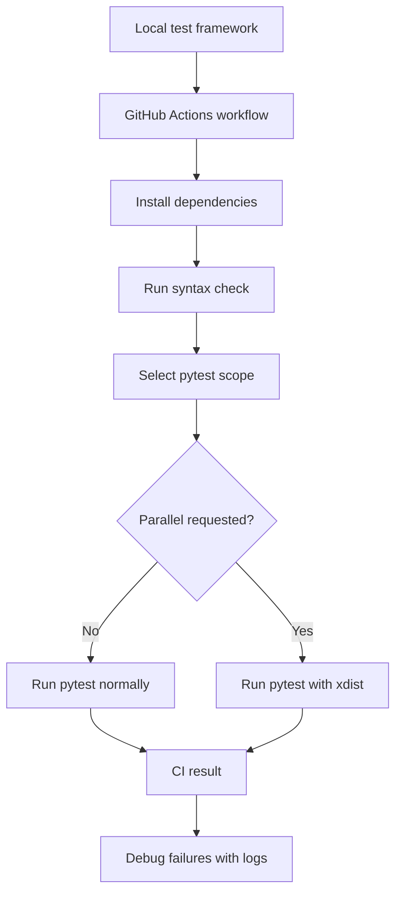
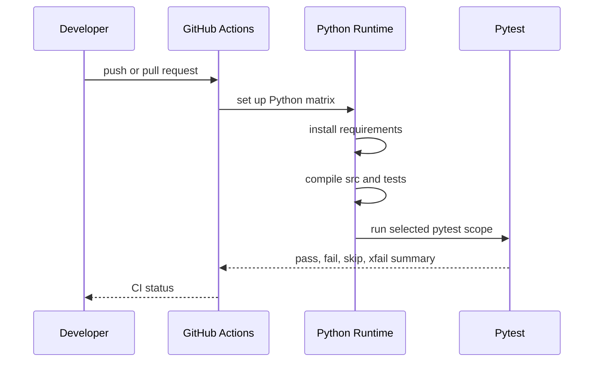

# Module 13: CI/CD Integration

Module 13 moves the framework from local-only execution to repeatable CI execution with GitHub Actions. It teaches how a test automation project decides what to run automatically, what to make selectable, how to keep environment-dependent tests stable, and how optional parallel execution fits into the strategy.

The module adds a real workflow at `.github/workflows/api-tests.yml` and tests that treat the workflow as project configuration.

## What This Module Builds

| Area | Files | Purpose |
| --- | --- | --- |
| GitHub Actions workflow | `.github/workflows/api-tests.yml` | Runs install, syntax checks, and pytest in CI |
| Parallel dependency | `requirements.txt` | Activates `pytest-xdist` for optional parallel execution |
| CI contract tests | `tests/learning/test_13_cicd/test_ci_workflow_contract.py` | Verifies workflow triggers, quality gates, markers, and xdist strategy |
| Learning docs | `docs/module-13-cicd-integration/` | Explains CI flow, test selection, reliability, and debugging |

## Learning Flow

## Concepts Covered

| Concept | What you learn | Code reference |
| --- | --- | --- |
| CI workflow triggers | Running on push, pull request, and manual dispatch | `.github/workflows/api-tests.yml` |
| Dependency installation | Rebuilding the environment from `requirements.txt` | `Install dependencies` step |
| Quality gates | Syntax check before pytest | `python -m compileall -q src tests` |
| Marker-based selection | Running `full`, `smoke`, `performance`, or `security` scopes | `TEST_SCOPE` in the workflow |
| Optional parallel execution | Running pytest with `-n auto` only when requested | `PARALLEL` in the workflow |
| Workflow contract testing | Testing CI configuration with pytest | `test_ci_workflow_contract.py` |
| CI reliability | Isolating config tests from real environment variables | `tests/learning/test_07_framework/test_config.py` |

## CI Pipeline Shape

## What Is Intentionally Deferred

Module 13 does not add HTML reports, Allure reports, screenshots, or published artifacts. Those belong to Module 14.

Module 13 also does not add Dockerized execution, deployment pipelines, environment provisioning, or secret-backed staging login flows. Those are later or post-capstone topics.

## Quality Gate

Module 13 is complete when:

- `.github/workflows/api-tests.yml` runs on push, pull request, and manual dispatch.
- CI installs from `requirements.txt`.
- CI runs `python -m compileall -q src tests` before pytest.
- CI can run full, smoke, performance, and security scopes.
- `pytest-xdist` is active for optional parallel execution.
- tests validate the workflow contract.
- docs explain CI reliability, marker strategy, and debugging.
- `python -m pytest tests/learning/test_13_cicd -v` passes.
- an xdist smoke run passes locally.
- the full suite passes with `python -m pytest tests/ -v`.

## Key Takeaways

- CI should rebuild the environment from versioned project files.
- Marker selection lets a project run different test scopes for different situations.
- Parallel execution is a strategy, not a default assumption.
- Tests that depend on environment defaults must isolate those environment variables.
- Reporting and artifact publishing should be added deliberately in the reporting module.
