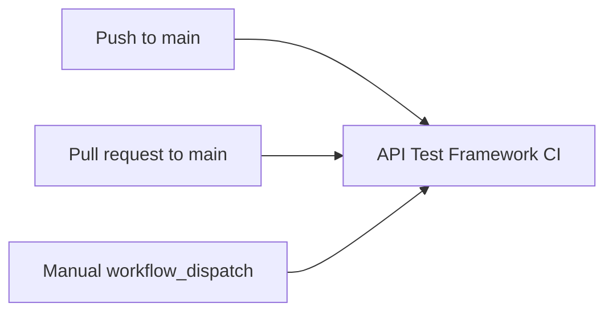
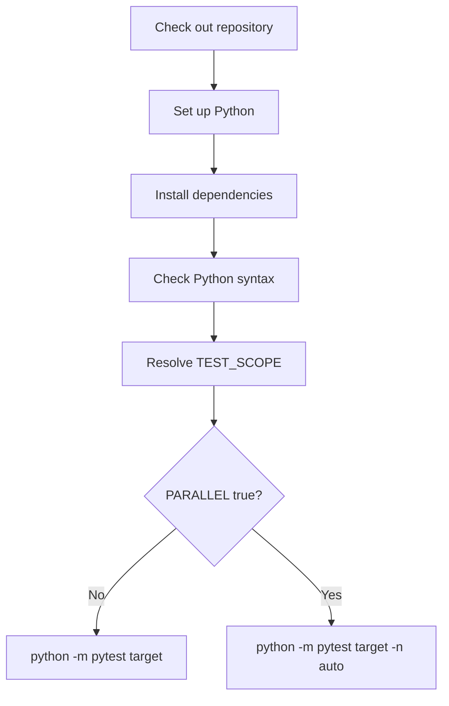

# GitHub Actions Workflow

The Module 13 workflow lives at `.github/workflows/api-tests.yml`. It is the first real CI entry point for the project.

## Workflow Triggers

The workflow runs on:

- pushes to `main`
- pull requests targeting `main`
- manual dispatch from GitHub Actions



Manual dispatch accepts two inputs:

| Input | Values | Purpose |
| --- | --- | --- |
| `test_scope` | `full`, `smoke`, `performance`, `security` | Selects which pytest scope to run |
| `parallel` | `true`, `false` | Chooses normal pytest or xdist execution |

## Workflow Steps



The important principle is that CI does not rely on your local virtual environment. It creates a new environment and installs dependencies from `requirements.txt`.

## Python Matrix

The workflow runs on Python `3.10` and `3.12`.

This gives useful coverage because:

- `3.10` is the minimum supported version in `pyproject.toml`
- `3.12` represents a newer stable Python version
- the matrix catches compatibility issues earlier than one local version can

## Environment Variables

The workflow sets explicit defaults:

```yaml
env:
  BASE_URL: "https://jsonplaceholder.typicode.com"
  HTTPBIN_URL: "https://httpbin.org"
  TEST_TIMEOUT: "10"
  TEST_ENV: "ci"
  LOG_LEVEL: "INFO"
```

This makes CI behavior visible. It also makes it clear when tests should use configured values versus when a test should isolate itself from environment variables.

## Why Compile Before Pytest

The workflow runs:

```bash
python -m compileall -q src tests
```

This catches syntax errors across source and test files before pytest selection filters are applied. For example, if CI runs only `-m smoke`, compileall still checks files outside the smoke subset.

## Workflow Contract Tests

`tests/learning/test_13_cicd/test_ci_workflow_contract.py` checks the workflow for required behavior:

- workflow file exists
- workflow has push, pull request, and manual triggers
- workflow installs dependencies
- workflow runs compileall
- workflow runs pytest
- workflow supports selectable scopes
- workflow supports optional xdist execution

These tests do not replace GitHub Actions. They make accidental workflow drift visible in the normal test suite.

## Key Takeaways

- CI starts from project files, not your local machine state.
- Workflow triggers decide when automation runs.
- Explicit environment variables make CI behavior easier to reason about.
- Contract tests can protect workflow intent.
