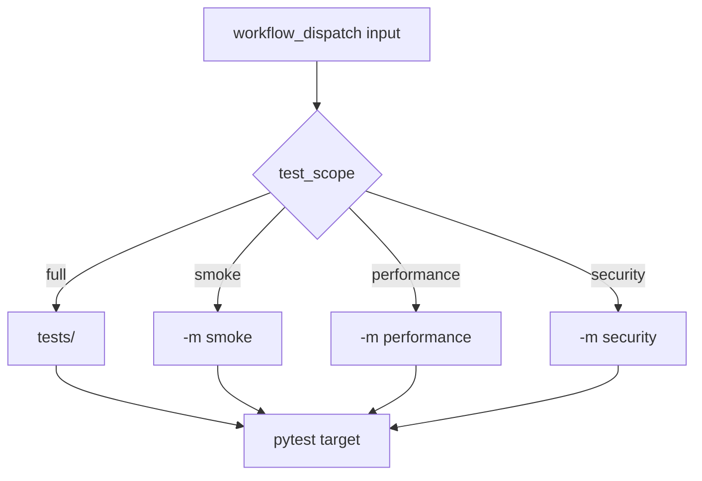

# Test Selection And Markers

CI does not always need to run every test in every situation. Module 13 uses pytest markers and workflow inputs to make test selection explicit.

## Marker Strategy

Markers are declared in [`pyproject.toml`](../../pyproject.toml):

```toml
markers = [
    "smoke: quick health check tests",
    "performance: response-time checks",
    "security: introductory security checks",
]
```

The workflow maps manual `test_scope` input to pytest commands:

| Scope | Command shape | Use case |
| --- | --- | --- |
| `full` | `python -m pytest tests/` | Main branch and pull request validation |
| `smoke` | `python -m pytest -m smoke` | Quick API health signal |
| `performance` | `python -m pytest -m performance` | Response-time smoke checks |
| `security` | `python -m pytest -m security` | Introductory security checks |

## Selection Flow



## Why Not Run Only Smoke In CI

Smoke tests are useful, but they are not enough for pull request confidence. A smoke suite answers whether a few high-value paths are alive. It does not prove schema validation, data-driven tests, mocked error handling, or framework helpers still work.

For this project:

- pull requests should run the full suite
- manual dispatch can run focused scopes when debugging
- future scheduled jobs can run selected scopes if needed

## Marker Risks

Markers are powerful, but they can hide coverage if used carelessly.

Common mistakes:

- marking too many tests as smoke
- forgetting to register markers in [`pyproject.toml`](../../pyproject.toml)
- relying on marker-only CI for merge confidence
- using performance markers with unstable live thresholds
- treating security markers as a full security audit

## Local Commands

Run full suite:

```bash
python -m pytest tests/ -v
```

Run smoke tests:

```bash
python -m pytest -m smoke -v
```

Run performance checks:

```bash
python -m pytest -m performance -v
```

Run security checks:

```bash
python -m pytest -m security -v
```

## Key Takeaways

- Markers help CI run the right scope for the situation.
- Full CI gives broader confidence than smoke-only CI.
- Marker strategy must stay documented and registered.
