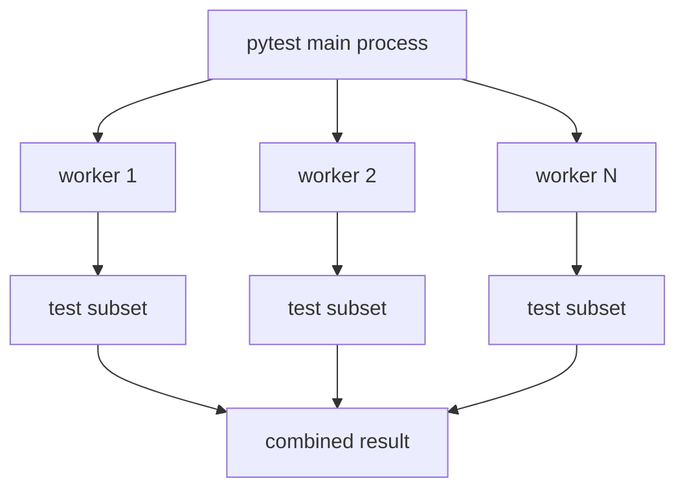

# Parallel Execution With Xdist

Module 13 activates `pytest-xdist` for optional parallel execution.

The dependency is active in `requirements.txt`:

```text
pytest-xdist==3.6.1
```

## What Xdist Does

`pytest-xdist` runs tests across multiple worker processes:

```bash
python -m pytest tests/ -n auto
```



## Why Parallel Is Optional

Parallel execution is useful, but it changes failure modes.

It can expose:

- shared mutable state between tests
- reliance on execution order
- file write collisions
- rate limit issues against public APIs
- hidden assumptions in fixtures

Because this project uses public learning APIs, the workflow makes xdist optional through the `parallel` manual input. That lets learners compare normal and parallel execution deliberately.

## What Makes Tests Parallel-Friendly

Good parallel-friendly tests:

- avoid depending on test order
- avoid sharing mutable global state
- use function-scoped clients where auth/session state changes
- write to unique files if file output is required
- isolate environment variable mutations with `monkeypatch`
- keep mocked HTTP state inside each test

## Config Test Reliability

The review finding about `tests/learning/test_07_framework/test_config.py` is a CI reliability issue.

Default-value tests must clear environment variables before asserting defaults because CI sets environment variables intentionally. The current tests use `clear_settings_environment(monkeypatch)` before default assertions, which keeps those tests deterministic.

## Local Parallel Commands

Run smoke tests with two workers:

```bash
python -m pytest -m smoke -n 2 -v
```

Run the full suite with automatic worker count:

```bash
python -m pytest tests/ -n auto
```

## When Not To Use Parallel Execution

Avoid or delay parallel execution when:

- the target API has strict rate limits
- tests create shared remote data
- tests write to the same report files
- failures become harder to debug than the speed gain is worth

## Key Takeaways

- Xdist can speed up test runs, but it also tests your isolation assumptions.
- Optional parallel CI is a safer teaching step than forcing all runs to be parallel.
- Environment-dependent tests must use `monkeypatch` or fixtures to stay deterministic.
