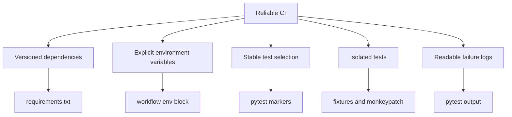

# CI Reliability And Environments

CI is valuable only when failures are meaningful. If CI fails because of hidden environment assumptions, unstable test data, or unclear scopes, the team stops trusting it.

Module 13 focuses on reliability before adding richer reports.

## CI Reliability Map



## Versioned Dependencies

The workflow installs:

```bash
python -m pip install -r requirements.txt
```

This means CI uses the same dependency declarations as the project, including:

- `pytest`
- `requests`
- `faker`
- `jsonschema`
- `responses`
- `pytest-xdist`

## Explicit Environment Variables

The workflow defines API base URLs and test settings in one visible `env` block.

This is better than relying on a hidden runner environment because learners can see exactly what the CI process receives.

## Isolating Defaults From CI Env

Some tests need to verify defaults. Other tests need to verify environment overrides.

These are different test goals:

| Test goal | Setup |
| --- | --- |
| Defaults | Clear relevant env vars first |
| Overrides | Set specific env vars with `monkeypatch.setenv()` |
| Invalid env value | Set one invalid env var and assert failure |

That is why `tests/learning/test_07_framework/test_config.py` clears config variables before default assertions.

## Public API Risk

This project uses public learning APIs. CI can fail if:

- the public API is down
- the runner has temporary network problems
- a public endpoint behavior changes
- rate limits or throttling appear

Module 11 introduced mocked tests for rare and unstable behavior. Module 13 still runs live tests because learning real API behavior is part of the project, but the docs should make the tradeoff explicit.

## Secrets

Module 13 does not add real secrets. When secrets become necessary in future projects:

- store them in GitHub Actions secrets
- pass them through environment variables
- never commit them to `.env`, docs, or test data
- redact them in logs and reports

Module 12 already introduced redaction helpers. Module 14 will connect log/report handling more directly.

## Key Takeaways

- Reliable CI starts with deterministic setup.
- Default-value tests must not accidentally read CI environment overrides.
- Public API tests are useful, but they carry network and provider risk.
- Secrets should enter CI through secret stores, not repository files.
