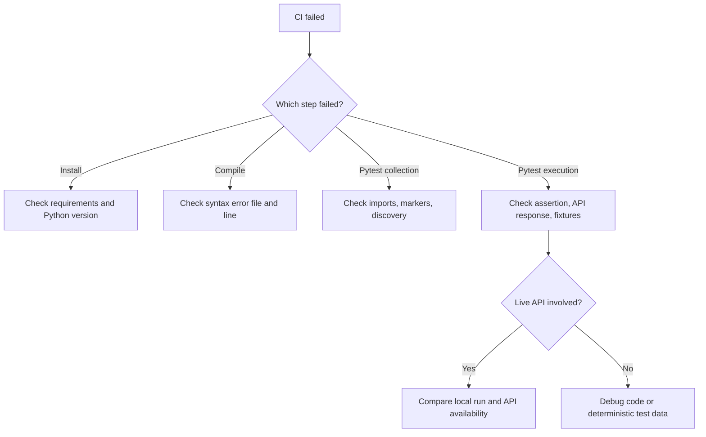

# Debugging CI Failures

CI failure debugging is a testing skill. The goal is to quickly decide whether the failure is caused by code, test data, environment, dependency installation, network behavior, or CI configuration.

## Failure Triage Flow



## Read The Failing Step First

The workflow has separate steps:

1. Install dependencies
2. Check Python syntax
3. Run pytest

This separation matters. A compile failure is not debugged the same way as an assertion failure.

## Common Failure Types

| Symptom | Likely area | First check |
| --- | --- | --- |
| Dependency cannot install | Requirements or Python version | [`requirements.txt`](../../requirements.txt), matrix version |
| Syntax error | Python file changed | compileall output |
| Marker not found warning | Pytest config | [`pyproject.toml`](../../pyproject.toml) marker list |
| Default config assertion fails | Environment isolation | `monkeypatch.delenv()` setup |
| Live API status differs | Public API behavior | rerun locally and inspect response |
| Parallel-only failure | Test isolation | shared state, order dependence, file writes |

## Local Reproduction Commands

Run the same syntax gate:

```bash
python -m compileall -q src tests
```

Run the full suite:

```bash
python -m pytest tests/ -v
```

Run the same marker scope:

```bash
python -m pytest -m smoke -v
```

Run a parallel smoke check:

```bash
python -m pytest -m smoke -n 2 -v
```

## Debugging Parallel Failures

If a failure only appears with xdist:

1. Rerun the same command without `-n`.
2. Rerun the failing test file alone.
3. Look for shared mutable state.
4. Look for environment variables changed without `monkeypatch`.
5. Look for shared output files or fixed temporary paths.

## What Module 14 Will Add

Module 14 will improve report-based failure analysis with HTML/Allure reporting and richer logs. Module 13 intentionally keeps output simple so learners understand the CI pipeline before adding report artifacts.

## Key Takeaways

- Debug the failed workflow step, not the whole pipeline at once.
- Reproduce CI commands locally when possible.
- Parallel-only failures usually point to isolation problems.
- Reporting improves analysis, but it should come after the CI flow is clear.
