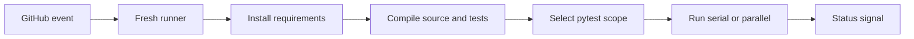

# Module 13 Checkpoint Deep Dive

This checkpoint makes the framework repeatable outside the local machine. The GitHub Actions workflow installs dependencies, checks syntax, selects a test scope, and optionally runs with xdist.

## Mental Model

CI is a clean-room execution contract:

If a test only passes because of local machine state, CI should expose that weakness.

## Execution Flow

For the workflow in [`.github/workflows/api-tests.yml`](../../.github/workflows/api-tests.yml):

1. A push, pull request, or manual dispatch starts the workflow.
2. The matrix runs on Python 3.10 and 3.12.
3. GitHub Actions checks out the repository.
4. `actions/setup-python` installs the selected Python version and enables pip cache.
5. Dependencies are installed from [`requirements.txt`](../../requirements.txt).
6. `python -m compileall -q src tests` catches syntax errors before pytest.
7. The shell case statement maps `TEST_SCOPE` to a pytest target.
8. If `PARALLEL` is true, pytest runs with `-n auto`; otherwise it runs normally.

## Code Walkthrough

[`api-tests.yml`](../../.github/workflows/api-tests.yml) is the production CI configuration for this learning project. It defines triggers, environment defaults, a Python version matrix, install steps, syntax checks, marker-based selection, and optional parallel execution.

[`test_ci_workflow_contract.py`](../../tests/learning/test_13_cicd/test_ci_workflow_contract.py) treats the workflow as project configuration worth testing. It checks that important strings and options remain present. This is intentionally simple: the test protects learning-critical behavior without introducing a YAML parser yet.

[`pyproject.toml`](../../pyproject.toml) remains part of the CI story because marker selection only works cleanly when markers such as `smoke`, `performance`, and `security` are registered.

## YAML And Framework Syntax To Notice

| Syntax | Why It Matters |
|---|---|
| `on: push/pull_request/workflow_dispatch` | Defines automatic and manual entry points |
| `strategy.matrix.python-version` | Verifies supported Python versions |
| `cache-dependency-path: requirements.txt` | Ties pip cache invalidation to [`requirements.txt`](../../requirements.txt) |
| `env:` | Provides CI-safe defaults for framework settings |
| shell `case "$TEST_SCOPE"` | Maps friendly scope names to pytest targets |
| `python -m pytest -m smoke` | Uses markers for focused runs |
| `-n auto` | Enables optional xdist parallel execution |
| workflow contract tests | Prevent accidental loss of CI behavior |

## Responsibility Boundaries

At this checkpoint:

- CI may install, compile, run selected pytest scopes, and optionally run parallel.
- Workflow tests may verify important configuration expectations.
- The workflow should not publish reports yet.
- It should not provision environments, deploy services, or manage real secrets.
- Parallel execution should remain optional because not every test pattern is automatically parallel-safe.

Module 14 owns reporting artifacts and richer failure analysis.

## Common Mistakes

- Assuming local virtualenv packages exist in CI.
- Running only smoke tests in CI and losing regression signal.
- Turning on parallel execution before checking test isolation.
- Forgetting to register markers and getting noisy marker warnings.
- Putting real secrets directly into workflow YAML.
- Making workflow contract tests so broad that every harmless YAML edit breaks them.

## Debugging And Failure Model

| Failure | Likely Cause |
|---|---|
| Dependency install fails | Bad requirement, network package issue, or incompatible Python |
| Compile step fails | Syntax error or invalid import-time code path |
| Marker scope runs no tests | Marker name mismatch or missing markers |
| Parallel run flakes | Shared state, order dependency, or external API pressure |
| Workflow input ignored | `TEST_SCOPE` or `PARALLEL` mapping changed |
| Contract test fails | Workflow behavior changed or test expectation needs updating |

Debug CI from the earliest failing step. A pytest failure has a different root cause from an install or syntax-check failure.

## Interview Readiness

After this module, you should be able to answer:

- Why should CI install from [`requirements.txt`](../../requirements.txt)?
- Why run syntax checks before pytest?
- How do markers support CI strategy?
- When is parallel execution risky?
- What does a workflow contract test protect?
- Why are reports deferred to a separate module?

## Revision Checklist

- I can trace the workflow from trigger to pytest command.
- I can explain each CI environment variable.
- I can choose the right test scope for full, smoke, performance, or security runs.
- I can explain why xdist is optional.
- I can read a CI failure and classify it by pipeline step.
