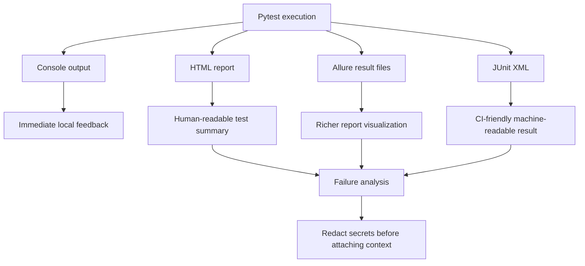
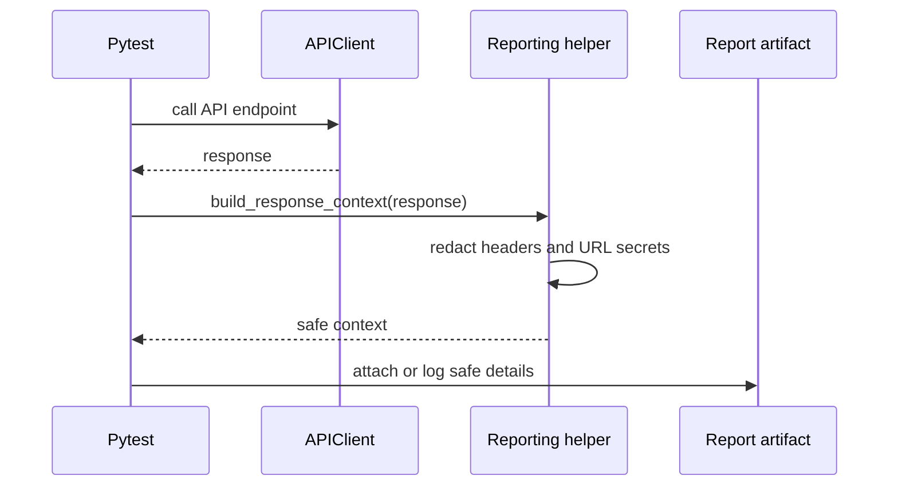

# Module 14: Reporting

Module 14 adds report generation and failure-analysis support to the API testing framework. It activates `pytest-html` and `allure-pytest`, adds safe report-context helpers, verifies API client logging, and updates CI to upload generated report artifacts.

The important learning goal is not just producing files. It is learning what information belongs in reports, what must be redacted, and how reports help debug failures without leaking secrets.

## What This Module Builds

| Area | Files | Purpose |
| --- | --- | --- |
| Reporting dependencies | `requirements.txt` | Activates `pytest-html` and `allure-pytest` |
| Reporting marker | `pyproject.toml` | Adds `@pytest.mark.reporting` |
| Report helpers | `src/utils/reporting.py` | Builds redacted response context for reports and logs |
| URL redaction | `src/utils/security.py` | Redacts sensitive query values before URLs enter report context |
| Reporting tests | `tests/learning/test_14_reporting/` | Verifies plugins, logs, safe context, and CI artifact settings |
| CI report artifacts | `.github/workflows/api-tests.yml` | Generates HTML, Allure result files, JUnit XML, and uploads `reports/` |

## Learning Flow

## Concepts Covered

| Concept | What you learn | Code reference |
| --- | --- | --- |
| HTML reporting | Generate a self-contained pytest report | `pytest-html` in `requirements.txt` |
| Allure results | Generate structured result files for Allure | `allure-pytest` in `requirements.txt` |
| JUnit XML | Produce CI-consumable test result XML | `.github/workflows/api-tests.yml` |
| Report artifacts | Upload generated `reports/` files from CI | `actions/upload-artifact@v4` |
| Safe report context | Attach method, URL, status, request id, headers, and body preview | `src/utils/reporting.py` |
| Secret redaction | Redact auth headers and sensitive query values | `src/utils/security.py` |
| Logging for reports | Verify request/response summary logs | `test_logging_output.py` |

## Reporting Pipeline

## What Is Intentionally Deferred

Module 14 does not require the Allure command-line viewer to be installed. The framework generates Allure result files; rendering a full Allure HTML site can be done when the CLI is available.

Module 14 also does not add screenshots, videos, or browser artifacts because this is an API testing framework. It focuses on request/response context, logs, and CI artifacts.

## Quality Gate

Module 14 is complete when:

- `pytest-html` and `allure-pytest` are active dependencies.
- `@pytest.mark.reporting` is registered.
- report helper tests verify redaction of sensitive headers and URL query values.
- API client logging is verified with `caplog`.
- CI generates HTML, Allure result files, and JUnit XML.
- CI uploads `reports/` as an artifact.
- docs link every reporting concept to real files.
- `python -m pytest tests/learning/test_14_reporting -v` passes.
- a sample report-generation command passes.
- the full suite passes with `python -m pytest tests/ -v`.

## Key Takeaways

- Reports are debugging tools, not decoration.
- Reports should include useful context without leaking credentials.
- HTML, Allure, and JUnit solve different reporting needs.
- CI should preserve report artifacts even when tests fail.
