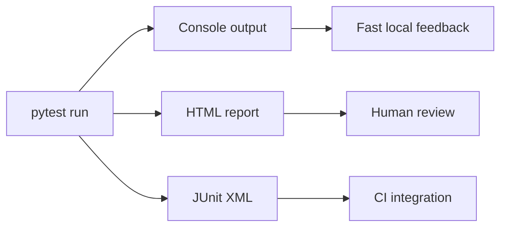

# Pytest HTML And JUnit XML

`pytest-html` creates a human-readable HTML report from a pytest run. JUnit XML creates a machine-readable result file that CI systems can parse.

Module 14 uses both because they answer different questions.

## Report Types



## Dependency

`pytest-html` is active in [`requirements.txt`](../../requirements.txt):

```text
pytest-html==4.1.1
```

The plugin is verified by [`test_reporting_plugins.py`](../../tests/learning/test_14_reporting/test_reporting_plugins.py).

## Local HTML Report Command

Run:

```bash
python -m pytest tests/learning/test_14_reporting \
  --html=reports/module-14-report.html \
  --self-contained-html
```

The `--self-contained-html` flag embeds report assets into one HTML file. That makes the report easier to share as a single artifact.

## JUnit XML Command

Run:

```bash
python -m pytest tests/ \
  --junitxml=reports/junit.xml
```

JUnit XML is useful in CI because tools can parse pass/fail counts, skipped tests, and failure details.

## CI Usage

The CI workflow writes:

```text
reports/pytest-report.html
reports/junit.xml
```

The workflow then uploads the [`reports/`](../../reports/) directory with `actions/upload-artifact@v4`.

## When HTML Helps

HTML reports help when you need:

- a readable test summary
- failure tracebacks outside the terminal
- a file to attach to CI runs
- a quick artifact for manual review

## When JUnit Helps

JUnit XML helps when you need:

- CI test result parsing
- historical test result tools
- integration with dashboards
- machine-readable pass/fail metadata

## Key Takeaways

- HTML reports are for humans.
- JUnit XML is for CI systems and tooling.
- Generating reports should not replace clear test assertions.
