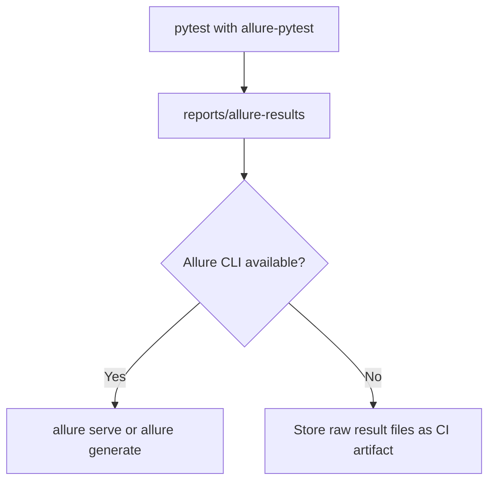

# Allure Results

Allure provides richer test reporting than a simple HTML summary. The `allure-pytest` plugin generates Allure result files during a pytest run.

Module 14 activates the plugin and teaches the result-generation step.

## Dependency

`allure-pytest` is active in `requirements.txt`:

```text
allure-pytest==2.13.5
```

The plugin is verified in `tests/learning/test_14_reporting/test_reporting_plugins.py`.

## Generate Allure Result Files

Run:

```bash
python -m pytest tests/learning/test_14_reporting \
  --alluredir=reports/allure-results
```

This creates raw Allure result files. Rendering those files into a navigable Allure HTML site requires the Allure command-line tool, which is intentionally not required in this module.

## Allure Flow



## Why Module 14 Stops At Result Files

The Python project should be able to generate Allure-compatible results with Python dependencies alone. The Allure CLI is a separate system dependency. Requiring it here would make the learning setup heavier and less portable.

CI can still upload `reports/allure-results` for later rendering or inspection.

## What Belongs In Allure Later

In a larger framework, Allure can include:

- feature and story labels
- links to tickets or requirements
- request/response attachments
- environment metadata
- retry history

Module 14 introduces the foundation without adding too much report decoration too early.

## Key Takeaways

- `allure-pytest` generates result files.
- The Allure CLI renders those files into a site.
- This module keeps CLI rendering optional.
