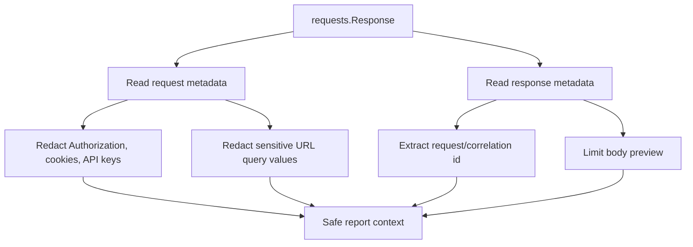

# Safe Report Context

Reports are useful only when they contain enough context to debug failures. But API reports often touch sensitive values such as bearer tokens, API keys, cookies, and query-string tokens.

Module 14 adds [`src/utils/reporting.py`](../../src/utils/reporting.py) to build safe response context.

## Context Shape

`build_response_context(response)` returns:

| Field | Purpose |
| --- | --- |
| `method` | HTTP method used by the request |
| `url` | Request URL with sensitive query values redacted |
| `status_code` | Response status code |
| `reason` | Response reason phrase |
| `elapsed_ms` | Response elapsed time when available |
| `request_id` | Correlation or request id from headers/body |
| `request_headers` | Redacted request headers |
| `response_headers` | Redacted response headers |
| `body_preview` | Bounded response body preview |
| `body_truncated` | Whether the body preview was shortened |

## Redaction Flow



## Header Redaction

The reporting helper reuses `redact_headers()` from [`src/utils/security.py`](../../src/utils/security.py).

The test `test_response_context_redacts_sensitive_headers` verifies:

- `Authorization` becomes `[REDACTED]`
- `X-API-Key` becomes `[REDACTED]`
- raw secret values are not present in the final context

## URL Query Redaction

Module 14 extends [`src/utils/security.py`](../../src/utils/security.py) with:

```python
redact_url_query_params(url)
```

This protects values such as:

- `access_token`
- `api_key`
- `password`
- `refresh_token`
- `secret`
- `token`

The test `test_response_context_redacts_sensitive_query_values` verifies that URL tokens do not leak into report context.

## JSON Body Redaction

Module 15 extends the same reporting helper for the capstone auth flow. JSON body fields such as `accessToken` and `refreshToken` are redacted before `body_preview` enters report context.

The regression tests live in `tests/learning/test_14_reporting/test_report_body_redaction.py`.

## Body Preview

Reports should not blindly attach huge response bodies. `truncate_text()` creates a bounded preview:

```python
truncate_text("abcdef", max_chars=3)
```

Result:

```text
abc...
```

This keeps reports readable and avoids unnecessarily large artifacts.

## Request Id Extraction

`extract_request_id()` checks common correlation headers:

- `X-Request-ID`
- `X-Correlation-ID`
- `X-Trace-ID`

It can also read `request_id` or `requestId` from a JSON body. This gives failures a useful id to search in service logs.

## Key Takeaways

- Reports should include enough context to debug failures.
- Secret redaction must happen before context enters logs or artifacts.
- URL query values can leak secrets just like headers.
- Body previews should be bounded.
