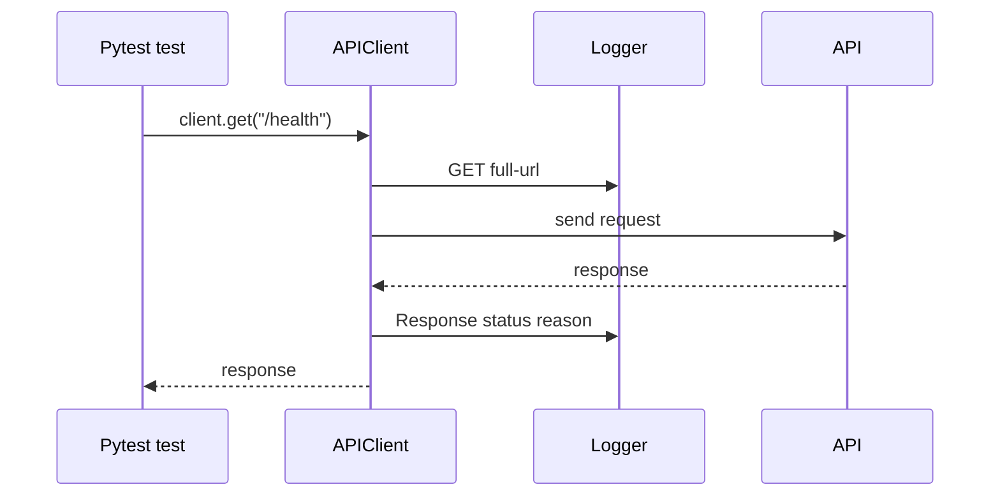

# Logs And Failure Analysis

Reports show what failed. Logs help explain how the test reached that failure.

The framework already logs request and response summaries in [`src/api_client/client.py`](../../src/api_client/client.py):

```python
logger.info("%s %s", method, url)
logger.info("Response: %s %s", response.status_code, response.reason)
```

Module 14 verifies this behavior with `caplog`.

## Log Flow



## Test Reference

[`test_logging_output.py`](../../tests/learning/test_14_reporting/test_logging_output.py) checks:

- the request line is logged
- the response status line is logged
- the test remains deterministic by using `responses`

## Log Summary Helper

`format_context_for_log()` in [`src/utils/reporting.py`](../../src/utils/reporting.py) turns report context into a compact line:

```text
GET https://service.test/search -> status=200 request_id=req-search
```

This kind of log line is useful because it includes:

- method
- URL
- status
- request id

It does not include full bodies or raw secrets.

## Good Failure Analysis

When a report shows a failure:

1. Check the failing assertion.
2. Check the status code and request id.
3. Check whether the response body preview explains the failure.
4. Check logs around the request.
5. Reproduce locally with the same pytest command when needed.

## What Not To Log

Do not log:

- raw bearer tokens
- API keys
- cookies
- passwords
- full response bodies by default
- personal data unless the test explicitly requires it and it is safe

## Key Takeaways

- Logs and reports work together.
- Request ids make failures easier to trace.
- Logs should summarize useful facts without leaking sensitive data.
