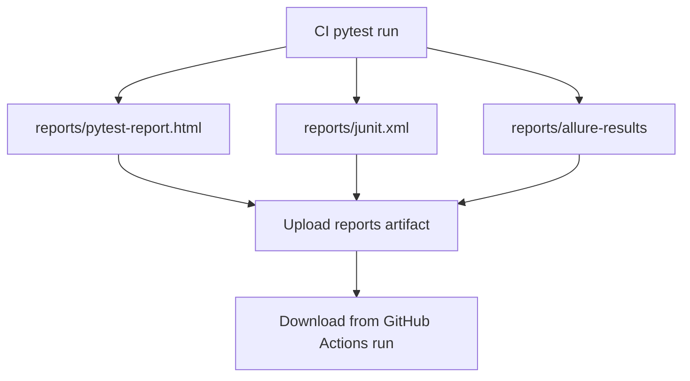

# CI Report Artifacts

Module 14 updates the GitHub Actions workflow so every CI run can preserve report files.

The workflow file is `.github/workflows/api-tests.yml`.

## CI Report Generation

The workflow builds a shared report argument string:

```bash
REPORT_ARGS="--html=reports/pytest-report.html --self-contained-html --alluredir=reports/allure-results --junitxml=reports/junit.xml"
```

Those args are added to normal and parallel pytest runs.

## Artifact Upload

The workflow uploads the `reports/` directory:

```yaml
- name: Upload test reports
  if: always()
  uses: actions/upload-artifact@v4
  with:
    name: test-reports-python-${{ matrix.python-version }}
    path: reports/
```

The `if: always()` line matters. It keeps report files available even when tests fail.

## CI Artifact Flow



## Matrix Naming

The artifact name includes the Python version:

```text
test-reports-python-${{ matrix.python-version }}
```

That avoids collisions when the matrix runs Python `3.10` and `3.12`.

## Why Reports Are Ignored By Git

The repository ignores `reports/` output in `.gitignore`. Reports are generated artifacts, not source code.

The project keeps only `reports/.gitkeep` so the directory exists in fresh clones.

## Key Takeaways

- CI should upload reports even on failure.
- Report artifacts should not be committed to git.
- Matrix jobs need distinct artifact names.
- Reports make CI failures easier to inspect after the terminal logs are gone.
