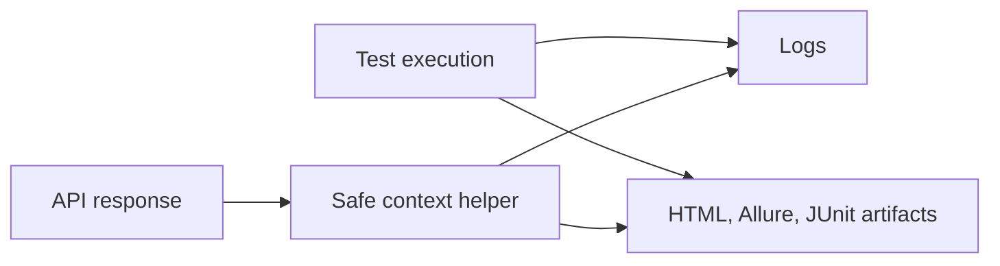

# Module 14 Checkpoint Deep Dive

This checkpoint turns test results into useful failure-analysis artifacts. The focus is not decorative reporting. The focus is preserving enough safe context to debug API failures locally and in CI.

## Mental Model

Reporting has two jobs:

Reports should answer "what failed, where, and with what safe evidence?" They should not leak tokens, cookies, API keys, or oversized bodies.

## Execution Flow

For safe response context:

1. A test receives a `requests.Response`.
2. [`build_response_context`](../../src/utils/reporting.py) reads the prepared request, response status, reason, elapsed time, headers, body text, and request ID.
3. Request headers and response headers are redacted with security helpers.
4. Sensitive URL query values are redacted before the URL enters logs or reports.
5. Body text is truncated to a bounded preview.
6. The resulting dictionary can be logged or attached to report artifacts.

For CI reporting, [`.github/workflows/api-tests.yml`](../../.github/workflows/api-tests.yml) runs pytest with HTML, Allure result, and JUnit XML output paths, then uploads the `reports/` directory.

## Code Walkthrough

[`src/utils/reporting.py`](../../src/utils/reporting.py) owns report-safe transformation. `truncate_text` prevents huge response bodies from overwhelming artifacts. `extract_request_id` looks for useful correlation headers or body fields. `format_context_for_log` turns context into a compact one-line summary.

[`test_safe_report_context.py`](../../tests/learning/test_14_reporting/test_safe_report_context.py) verifies redaction, URL query cleanup, correlation ID extraction, body truncation, and compact log formatting.

[`test_logging_output.py`](../../tests/learning/test_14_reporting/test_logging_output.py) uses `caplog` to prove [`APIClient`](../../src/api_client/client.py) logs request and response summaries.

[`test_reporting_plugins.py`](../../tests/learning/test_14_reporting/test_reporting_plugins.py) verifies reporting dependencies, `reports/`, and CI artifact settings.

## Python And Framework Syntax To Notice

| Syntax | Why It Matters |
|---|---|
| `response.request` | Gives access to the sent method, URL, and headers |
| `response.elapsed.total_seconds()` | Captures timing for report context |
| `except ValueError` around `response.json()` | Handles non-JSON bodies safely |
| `Mapping[str, Any]` | Accepts context-like dictionaries for log formatting |
| `caplog.at_level(...)` | Captures log output in a test |
| `importlib.util.find_spec(...)` | Checks plugin availability without importing plugin internals |
| `--html`, `--alluredir`, `--junitxml` | Produce different report artifact formats |
| `actions/upload-artifact@v4` | Preserves report files from CI runs |

## Responsibility Boundaries

At this checkpoint:

- Reporting helpers may build safe context and format compact log lines.
- Security helpers may redact sensitive headers and URL values.
- CI may generate and upload report artifacts.
- Tests may verify plugin availability and workflow report settings.
- The project does not require the Allure CLI viewer.
- Browser artifacts, screenshots, videos, and UI traces remain out of scope for this API-only framework.

## Common Mistakes

- Treating reports as a replacement for clear assertions.
- Attaching raw headers or URLs that include secrets.
- Logging entire response bodies for every failure.
- Assuming JUnit XML is human-friendly enough for root-cause analysis.
- Requiring local Allure viewer installation just to run the test suite.
- Uploading reports only on success and losing artifacts for failed CI runs.

## Debugging And Failure Model

| Failure | Likely Cause |
|---|---|
| Secret appears in context | Redaction list missed a header or query parameter |
| Missing request ID | API did not return a known correlation header or body field |
| Report plugin test fails | Dependency not installed from [`requirements.txt`](../../requirements.txt) |
| CI artifact missing | Workflow report path or upload step changed |
| Log assertion fails | API client log message format changed |
| Body preview too large | `max_body_chars` is too high or truncation not applied |

Reporting failures should be fixed by improving context safety or artifact configuration, not by removing useful evidence.

## Interview Readiness

After this module, you should be able to answer:

- What belongs in an API test report?
- Why are HTML, Allure, and JUnit reports all useful in different ways?
- How do you prevent secrets from leaking into artifacts?
- Why should CI upload reports when tests fail?
- How does logging support report-based failure analysis?
- Why does this API framework avoid screenshots and browser artifacts?

## Revision Checklist

- I can trace a response through [`build_response_context`](../../src/utils/reporting.py).
- I can explain how sensitive headers and URL values are redacted.
- I can describe the difference between HTML, Allure result files, and JUnit XML.
- I can read the CI workflow and identify report output paths.
- I can explain what report context is useful without being unsafe.
