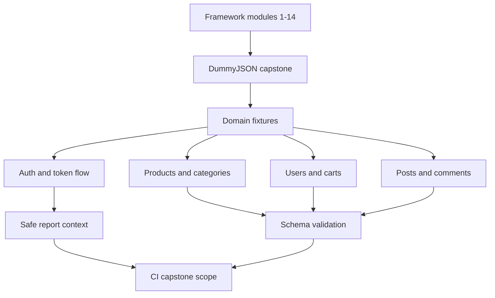

# Module 15: DummyJSON Capstone

Module 15 completes the rebuilt learning path by applying the framework to a realistic API target: DummyJSON. The capstone uses the project architecture built across Modules 1-14 and organizes tests by API domain under `tests/dummyjson/`.

DummyJSON is the capstone target because it has richer API behavior than JSONPlaceholder: JWT-style auth, refresh tokens, search, pagination, categories, nested product objects, carts, users, posts, and comments.

## What This Module Builds

| Area | Files | Purpose |
| --- | --- | --- |
| Capstone fixtures | `tests/dummyjson/conftest.py` | Creates DummyJSON clients, credentials, login data, and authenticated clients |
| Auth tests | `tests/dummyjson/test_auth.py` | Covers login, bearer auth, refresh tokens, invalid login, and token-safe reporting |
| Product tests | `tests/dummyjson/test_products.py` | Covers nested products, pagination, search, and categories |
| User tests | `tests/dummyjson/test_users.py` | Covers user collection, nested profile data, and search |
| Cart tests | `tests/dummyjson/test_carts.py` | Covers cart schemas, nested products, and total calculations |
| Posts/comments tests | `tests/dummyjson/test_posts_comments.py` | Covers posts, user filtering, and nested comment user summaries |
| DummyJSON schemas | `schemas/dummyjson/` | Validates realistic response contracts |
| CI capstone scope | `.github/workflows/api-tests.yml` | Adds `capstone` workflow scope mapped to `tests/dummyjson` |
| Reporting safety fix | `src/utils/reporting.py` | Redacts token fields from JSON body previews |

## Learning Flow

## Concepts Covered

| Concept | What you learn | Code reference |
| --- | --- | --- |
| Domain organization | Production-style test grouping by API area | `tests/dummyjson/` |
| Auth fixture design | Login once per test need and apply bearer token safely | `authenticated_dummyjson_client` |
| Refresh token nuance | Validate token pair presence without assuming immediate token rotation | `test_refresh_token_returns_usable_token_pair` |
| Nested contract validation | Use schemas for realistic nested products, carts, users, posts, and comments | `schemas/dummyjson/` |
| Search and pagination | Assert metadata and result shape, not brittle exact full payloads | `test_products.py`, `test_users.py` |
| Report safety | Redact token fields from body previews | `test_login_report_context_redacts_token_body` |
| CI capstone execution | Run the capstone as its own scope | `.github/workflows/api-tests.yml` |

## API References

The capstone is based on the current DummyJSON documentation:

- `https://dummyjson.com/docs/auth`
- `https://dummyjson.com/docs/products`
- `https://dummyjson.com/docs/users`
- `https://dummyjson.com/docs`

The tests also probe live behavior directly because public fake APIs can evolve.

## What Is Intentionally Deferred

Module 15 does not turn FakeStore into a second capstone. FakeStore remains optional comparison/practice.

Module 15 also does not add Docker, database testing, load testing, GraphQL, Kafka, WebSocket, gRPC, or deep observability. Those are post-capstone extension topics.

## Quality Gate

Module 15 is complete when:

- tests are organized under `tests/dummyjson/`.
- auth, products, users, carts, posts, and comments are covered.
- schema validation is applied to realistic nested responses.
- token responses are not leaked into report context previews.
- CI supports a `capstone` scope.
- docs explain how the whole framework fits together.
- `python -m pytest tests/dummyjson -v` passes.
- the full suite passes with `python -m pytest tests/ -v`.

## Key Takeaways

- The capstone is where tutorial pieces become a coherent framework.
- Domain organization makes API coverage easier to scan and maintain.
- Live public API tests need stable assertions and clear CI scope.
- Auth tokens need extra care in reports and logs.
- The rebuilt project now has an end-to-end learning path from Python basics to a CI-ready API framework.
