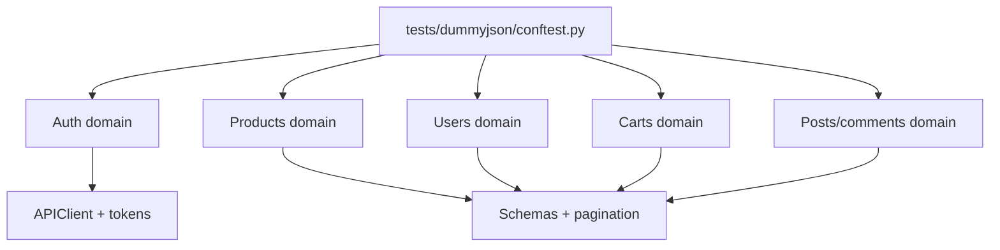

# Capstone Architecture

The capstone keeps tutorial learning code and production-style capstone code separate.

Tutorial modules live under:

```text
tests/learning/
```

The capstone lives under:

```text
tests/dummyjson/
```

## Test Layout

```text
tests/dummyjson/
├── conftest.py
├── test_auth.py
├── test_carts.py
├── test_posts_comments.py
├── test_products.py
└── test_users.py
```

## Domain Map



## Shared Fixtures

`tests/dummyjson/conftest.py` introduces:

| Fixture | Purpose |
| --- | --- |
| `dummyjson_client` | Function-scoped `APIClient` pointed at `settings.dummyjson_url` |
| `dummyjson_credentials` | Public demo credentials with env override support |
| `dummyjson_login_data` | Login response body containing access and refresh tokens |
| `authenticated_dummyjson_client` | Client with bearer token applied |

## Why Function-Scoped Clients

Function-scoped clients keep auth headers, cookies, and last response state isolated between tests.

This applies the lessons from earlier modules:

- Module 06: isolation for future parallel execution
- Module 08: auth state should be explicit
- Module 13: CI and xdist expose shared-state problems

## Schema Layout

DummyJSON schemas live under:

```text
schemas/dummyjson/
```

The capstone uses self-contained schema files. Collection schemas do not rely on external `$ref` files because the project schema helper intentionally loads one schema document at a time.

## CI Layout

Module 15 adds:

```text
capstone -> tests/dummyjson
```

to `.github/workflows/api-tests.yml`.

This lets CI run the capstone independently from the learning modules when needed.

## Key Takeaways

- Keep tutorial tests and capstone tests separate.
- Use fixtures to centralize setup, not assertions.
- Keep schemas aligned with the helper capabilities.
- Give the capstone its own CI scope.
