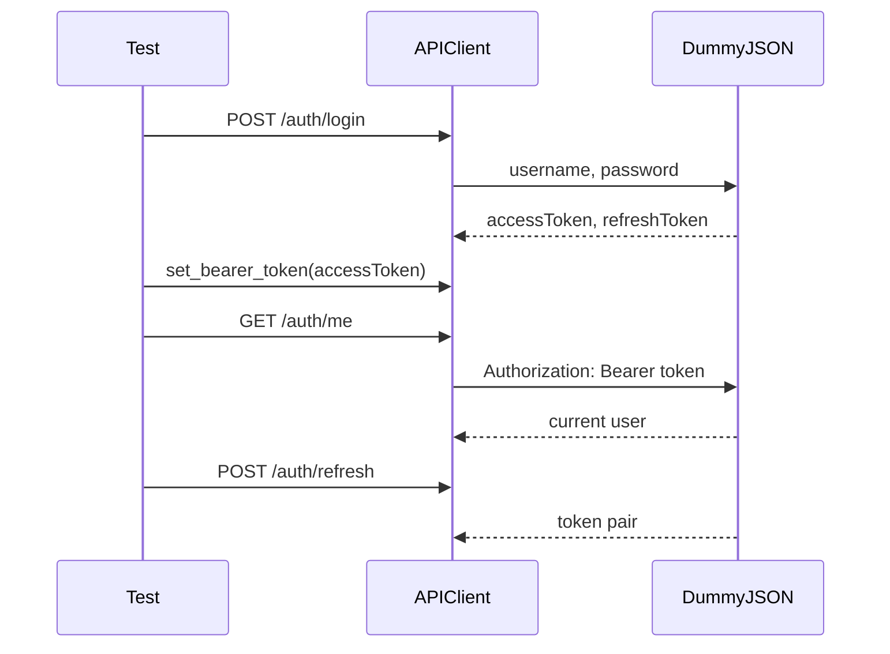

# Auth And Token Flow

DummyJSON auth gives the capstone a realistic token workflow:

1. Login with username and password.
2. Receive `accessToken` and `refreshToken`.
3. Use the access token as a bearer token.
4. Refresh the token pair when needed.
5. Keep tokens out of report context.

## Auth Flow



## Tests

[`test_auth.py`](../../tests/dummyjson/test_auth.py) covers:

- login returns user identity and tokens
- `/auth/me` works with bearer auth
- `/auth/refresh` returns a usable token pair
- invalid login returns a clear `400`
- login report context redacts token body fields

## Refresh Token Nuance

The capstone asserts that refreshed responses contain token strings. It does not assert that the refreshed token is always different from the login token.

That matters because token values can depend on server implementation, issue time, expiry window, and fake API behavior. A stable API test should validate the contract that matters: a usable token pair is returned.

## Report Safety

Auth responses include sensitive fields:

- `accessToken`
- `refreshToken`

Module 15 extends [`src/utils/reporting.py`](../../src/utils/reporting.py) so JSON body previews redact token-like fields before they enter logs or reports.

The capstone test `test_login_report_context_redacts_token_body` confirms that live login tokens are not present in `body_preview`.

## Credentials

The fixture defaults to DummyJSON's public demo user:

```text
username: emilys
password: emilyspass
```

The values can be overridden with:

```text
DUMMYJSON_USERNAME
DUMMYJSON_PASSWORD
```

## Key Takeaways

- Auth tests should verify both happy and negative paths.
- Token refresh tests should avoid brittle assumptions about token rotation.
- Reports must redact token fields from headers, URLs, and bodies.
