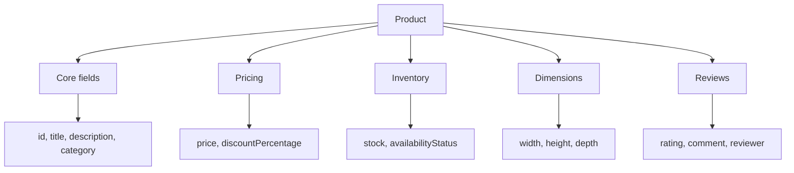

# Products, Search, Pagination, And Categories

The products domain is the richest DummyJSON area in the capstone. It has nested product fields, categories, search, and pagination metadata.

## Product Coverage

`tests/dummyjson/test_products.py` covers:

| Test | Purpose |
| --- | --- |
| `test_single_product_has_nested_ecommerce_shape` | Validates one detailed product with dimensions and reviews |
| `test_product_pagination_uses_limit_and_skip` | Checks `limit`, `skip`, result length, and total metadata |
| `test_product_search_returns_paginated_results` | Checks search result shape without brittle exact matches |
| `test_product_categories_drive_category_endpoint` | Uses category discovery to test category filtering |

## Product Shape



## Pagination Strategy

The capstone validates pagination metadata:

- `limit`
- `skip`
- `total`
- result array length

It avoids asserting exact global product counts except where the response itself declares metadata.

## Search Strategy

Search APIs can change ranking and matching behavior. The capstone asserts:

- response status is `200`
- response matches the collection schema
- `limit` is honored
- `total >= len(products)`
- at least one product is returned

This keeps the test focused on search contract behavior, not a brittle exact result order.

## Category Strategy

The category test first calls:

```text
GET /products/categories
```

Then it uses the first returned slug to call:

```text
GET /products/category/{slug}
```

This makes the test adapt to the category list returned by the API instead of hard-coding a category that might change later.

## Key Takeaways

- Search tests should avoid brittle rank/order assumptions.
- Pagination tests should verify metadata and result size.
- Category tests are stronger when they use discovery first.
- Nested response schemas help catch accidental contract drift.
