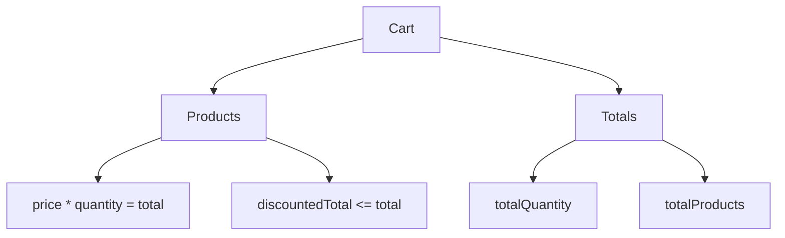

# Users, Carts, Posts, And Comments

The capstone includes multiple API domains so the learner sees how a framework scales beyond one endpoint family.

## Users

[`test_users.py`](../../tests/dummyjson/test_users.py) covers:

- user collection schema
- single user nested profile data
- search for the public demo user

The single-user test validates nested address and company data using [`user.schema.json`](../../schemas/dummyjson/user.schema.json).

## Carts

[`test_carts.py`](../../tests/dummyjson/test_carts.py) covers:

- user cart collection schema
- cart product totals
- discounted totals
- total quantity and product count consistency

## Posts And Comments

[`test_posts_comments.py`](../../tests/dummyjson/test_posts_comments.py) covers:

- post collection schema
- filtering posts by user id
- comments for one post
- nested comment user summary

## Why These Domains Matter

Together, these tests show several real API testing patterns:

| Domain | Pattern |
| --- | --- |
| Users | Nested profile objects |
| Carts | Calculated totals and nested products |
| Posts | Filtered collections |
| Comments | Parent-child resource relationship |

## Stable Assertion Style

The capstone avoids fragile assertions such as:

- exact full payload equality
- exact global totals unless the endpoint returns them
- exact result order for search
- assumptions that public data never changes

Instead it asserts stable contracts:

- required fields
- field types
- relationships
- metadata consistency
- domain invariants

## Key Takeaways

- A capstone suite should cover multiple API domains.
- Business assertions complement schema validation.
- Stable tests focus on contracts and relationships.
