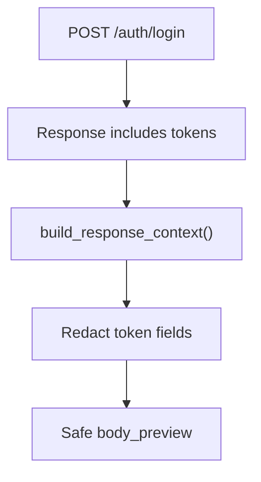

# Schemas, Reporting, And CI

Module 15 ties together the framework capabilities from the previous modules.

## Schema Strategy

DummyJSON schemas live under:

```text
schemas/dummyjson/
```

The capstone uses schemas for:

- auth login response
- products
- product collections
- users
- user collections
- carts
- posts
- comments

The schemas use `additionalProperties: true` where appropriate because the capstone tests are consumer-focused. DummyJSON can add provider fields without breaking this framework as long as the fields the tests depend on remain stable.

## Reporting Strategy

Module 15 uses Module 14 report safety in a real auth flow.



This guards against a common framework mistake: adding rich reports that accidentally expose secrets.

## CI Strategy

Module 15 adds a dedicated workflow scope:

```text
capstone -> tests/dummyjson
```

Run locally:

```bash
python -m pytest tests/dummyjson -v
```

Run by marker:

```bash
python -m pytest -m capstone -v
python -m pytest -m dummyjson -v
```

In GitHub Actions manual dispatch, choose:

```text
test_scope: capstone
```

## Full Suite Strategy

The normal full suite still runs:

```bash
python -m pytest tests/ -v
```

That includes learning tests and capstone tests. If DummyJSON is temporarily unavailable, the dedicated `capstone` scope makes it easier to isolate whether the issue is in the capstone target or the earlier learning modules.

## Quality Gates

Use these commands:

```bash
python -m compileall -q src tests
python -m pytest tests/dummyjson -v
python -m pytest tests/learning/test_14_reporting -v
python -m pytest tests/ -v
```

## Key Takeaways

- Schema validation provides structural confidence.
- Business assertions verify relationships and domain rules.
- Reporting helpers must protect tokens in real auth flows.
- A dedicated capstone CI scope makes live API issues easier to isolate.
