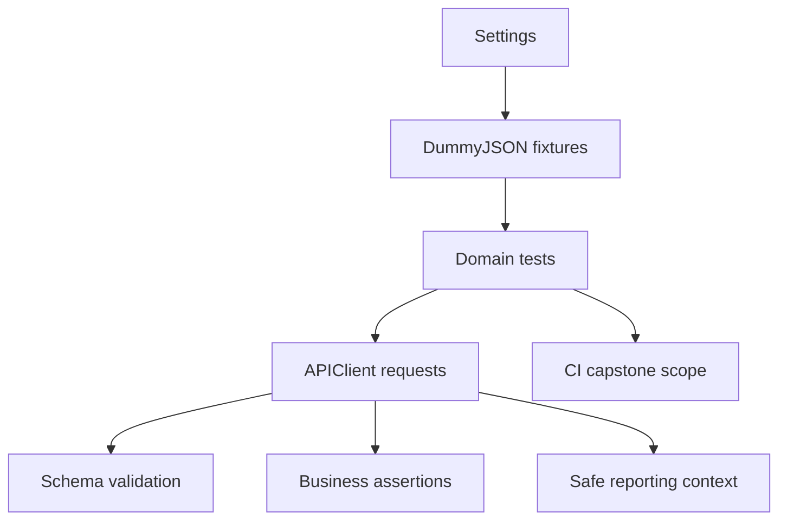

# Module 15 Checkpoint Deep Dive

This checkpoint is the capstone: the framework is applied to DummyJSON as a richer API target. The tests are organized by domain, use schemas for nested response contracts, exercise auth and token flows, and keep report context safe.

## Mental Model

The capstone combines the previous modules into one API testing workflow:

Each domain test should be readable on its own while still using shared framework pieces from earlier modules.

## Execution Flow

For an authenticated capstone test:

1. [`dummyjson_client`](../../tests/dummyjson/conftest.py) creates a function-scoped `APIClient` for DummyJSON.
2. `dummyjson_login_data` posts public demo credentials to `/auth/login`.
3. `authenticated_dummyjson_client` applies the access token with `set_bearer_token`.
4. The test calls an authenticated endpoint such as `/auth/me`.
5. The response is checked with status assertions, schema validation where applicable, and scenario-specific assertions.
6. Report helpers ensure token values are not leaked in body previews.

For non-auth domains, tests call products, users, carts, posts, and comments directly through the same client fixture.

## Code Walkthrough

[`tests/dummyjson/conftest.py`](../../tests/dummyjson/conftest.py) owns capstone fixture setup. Credentials are public DummyJSON demo defaults but can be overridden by environment variables for experiments.

[`test_auth.py`](../../tests/dummyjson/test_auth.py) validates login identity, token presence, bearer auth, refresh token response shape, invalid credentials, and report redaction for token bodies.

[`test_products.py`](../../tests/dummyjson/test_products.py) covers product detail, pagination, search, and category-driven endpoint behavior. It validates realistic nested product shapes with schemas under [`schemas/dummyjson/`](../../schemas/dummyjson/).

[`test_users.py`](../../tests/dummyjson/test_users.py), [`test_carts.py`](../../tests/dummyjson/test_carts.py), and [`test_posts_comments.py`](../../tests/dummyjson/test_posts_comments.py) exercise nested user profiles, cart totals, post filters, and nested comment user summaries.

## Python And Framework Syntax To Notice

| Syntax | Why It Matters |
|---|---|
| package-level `pytestmark` | Applies `capstone`, `dummyjson`, and domain markers consistently |
| `Iterator[APIClient]` fixtures | Express setup/yield/teardown for clients |
| environment-backed credentials | Allows local defaults and CI overrides |
| `json={**credentials, ...}` | Builds login payloads without mutating the credential fixture |
| `validate_json(body, schema)` | Applies real nested schemas to capstone responses |
| `pytest.approx(...)` | Handles floating-point total calculations safely |
| `any(...)` and `all(...)` | Express collection-level business rules |
| report context assertions | Prove token values are redacted before artifacts are generated |

## Responsibility Boundaries

At this checkpoint:

- Capstone tests live under [`tests/dummyjson/`](../../tests/dummyjson/) and are organized by API domain.
- Shared framework code remains in [`src/`](../../src/).
- DummyJSON schemas live under [`schemas/dummyjson/`](../../schemas/dummyjson/).
- Tests assert stable behavior, shape, pagination metadata, and nested relationships.
- Tests should not overfit to every field in a public API response.
- FakeStore, Docker, database testing, GraphQL, Kafka, WebSocket, gRPC, and deep observability remain post-capstone topics.

## Common Mistakes

- Treating the capstone as a random collection of endpoint checks instead of domain-organized coverage.
- Logging raw access or refresh tokens into report context.
- Assuming live public APIs never change.
- Making brittle assertions about every product or user field when only key contract behavior matters.
- Reusing authenticated state across tests without fixture boundaries.
- Forgetting that schema validation and business assertions answer different questions.

## Debugging And Failure Model

| Failure | Likely Cause |
|---|---|
| Login returns non-200 | Demo credentials changed, service changed, or network failed |
| `/auth/me` returns unauthorized | Bearer token was missing, malformed, or expired |
| Schema validation fails | DummyJSON response contract changed or schema is too strict |
| Pagination assertion fails | API changed default behavior or query params were not sent |
| Cart total mismatch | Floating-point precision or product calculation changed |
| Token appears in report context | Redaction helper missed body token fields |

For capstone failures, first decide whether the failure is auth, contract, business behavior, public API drift, or reporting safety.

## Interview Readiness

After this module, you should be able to answer:

- How would you organize API tests for a multi-domain service?
- How do fixtures support auth setup without leaking state?
- What should be validated by schema versus explicit assertions?
- How do you test pagination and search without brittle expectations?
- How do you keep tokens out of reports?
- What would you add next for a production API framework?

## Revision Checklist

- I can trace the login fixture chain in [`tests/dummyjson/conftest.py`](../../tests/dummyjson/conftest.py).
- I can explain why capstone tests are grouped by auth, products, users, carts, posts, and comments.
- I can map each DummyJSON schema to the test that uses it.
- I can explain the report-token redaction test.
- I can describe which post-capstone extensions are intentionally outside the 15-module path.
